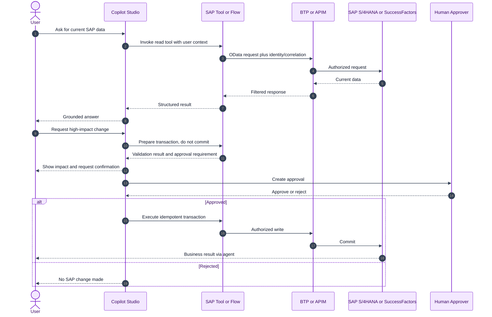
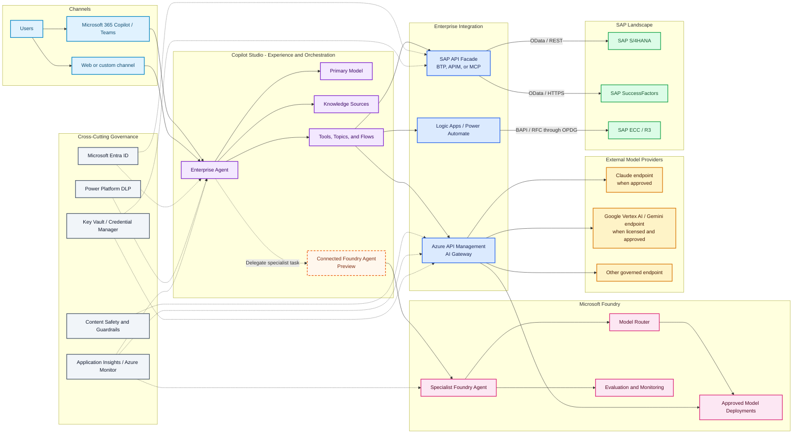
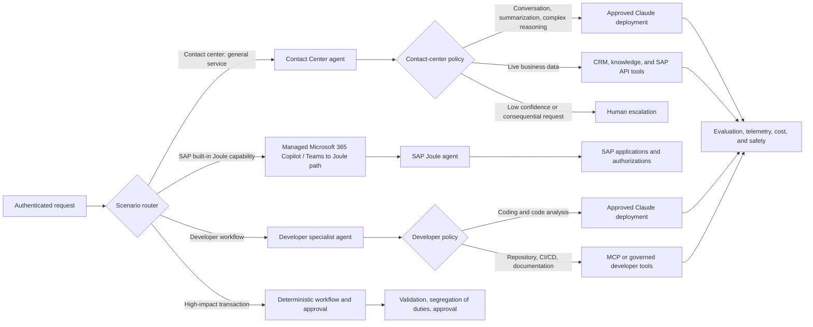
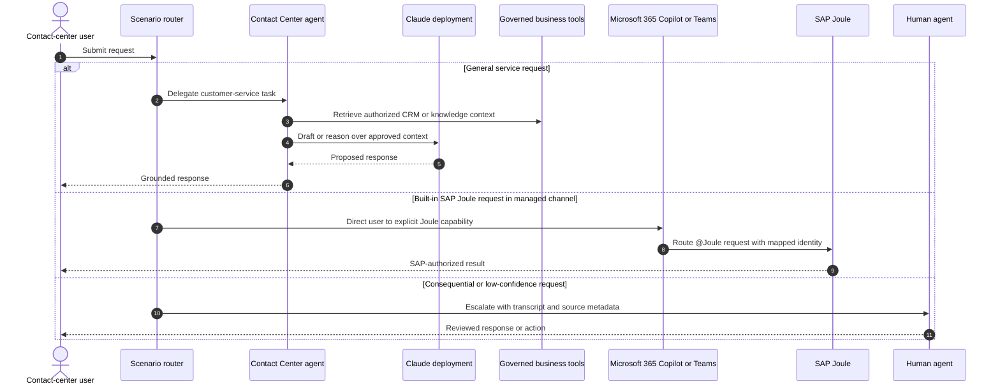
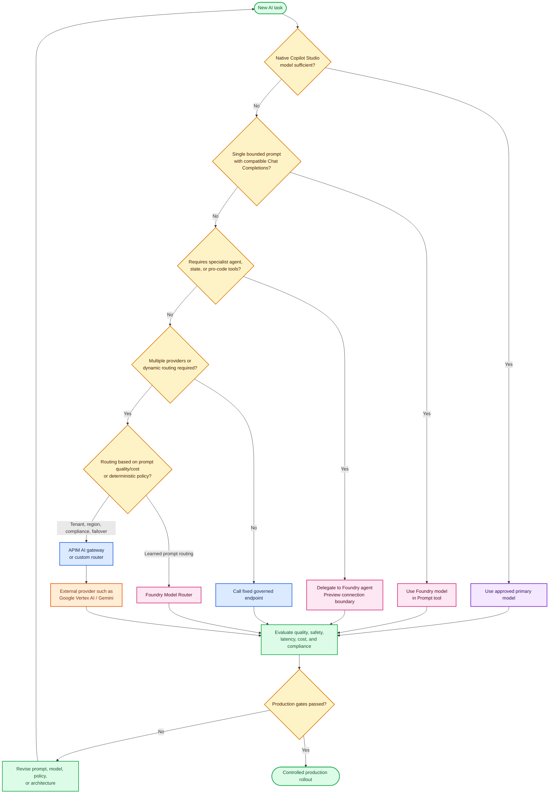
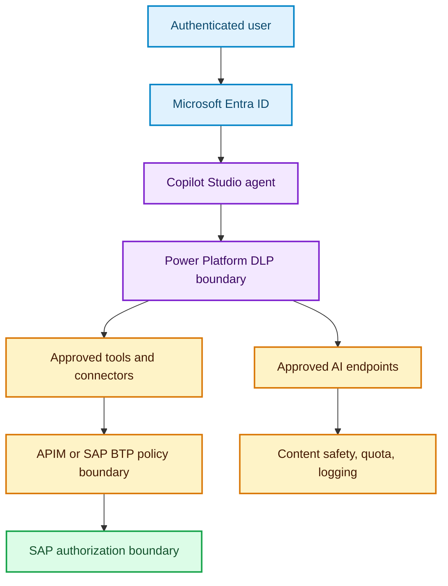

# L400 Architecture: Copilot Studio, Microsoft Foundry, SAP, and Multi-Model AI

> **Document type:** Explanation with Reference appendix (Diátaxis)  
> **Audience:** Enterprise solution architect  
> **Purpose:** Determine when to use Copilot Studio, Microsoft Foundry, SAP integration services, Model Router, and AI gateway for enterprise agent solutions  
> **Information status:** Verified against Microsoft Learn on **26 July 2026**  
> **Language:** English with official technical terms preserved

## Scope and validation notes

This document does not assume that all AI models can be directly installed into Copilot Studio.

- Copilot Studio only displays models supported for the relevant region, environment, and administrator policies ([Microsoft Learn: model availability and admin controls](https://learn.microsoft.com/microsoft-copilot-studio/authoring-select-agent-model#model-availability-by-region)).
- Microsoft Foundry is **not mandatory** for all Copilot Studio implementations.
- Integrating a Foundry model into a Prompt tool does not automatically replace the primary model or the entire agent orchestrator.
- Google Gemini is not documented as a native primary model for Copilot Studio as of the document verification date ([Microsoft Learn: primary-model availability](https://learn.microsoft.com/microsoft-copilot-studio/authoring-select-agent-model#model-availability-by-region)).
- Connected Microsoft Foundry agent remains in **Preview** status ([Microsoft Learn](https://learn.microsoft.com/microsoft-copilot-studio/add-agent-foundry-agent)).
- Features, models, release status, regions, pricing, and limits are subject to change. Re-validate Microsoft Learn pages before production deployment.

## Status legend

| Symbol | Meaning | Production use | Status source |
|---|---|---|---|
| 🟢 GA | Generally available | May be considered for production after organizational testing | [Microsoft Learn: model release types](https://learn.microsoft.com/microsoft-copilot-studio/authoring-select-agent-model#model-release-types) |
| 🟡 Preview | Preview and subject to preview terms | Do not assume SLA or GA stability | [Microsoft Learn: model release types](https://learn.microsoft.com/microsoft-copilot-studio/authoring-select-agent-model#model-release-types) |
| 🧪 Experimental | For early evaluation | Not recommended for production | [Microsoft Learn: experimental limitations](https://learn.microsoft.com/microsoft-copilot-studio/authoring-select-agent-model#limitations-of-experimental-and-preview-models) |
| 🌍 Cross-geo | Processing may occur outside the organization's geography | Requires data residency and administrator approval | [Microsoft Learn: model availability](https://learn.microsoft.com/microsoft-copilot-studio/authoring-select-agent-model#model-availability-by-region) |

---

## Table of contents

1. [Executive summary](#1-executive-summary)
2. [Can all models be used and is Foundry mandatory](#2-can-all-models-be-used-and-is-foundry-mandatory)
3. [How Copilot Studio uses LLMs](#3-how-copilot-studio-uses-llms)
4. [Copilot Studio and Microsoft Foundry integration patterns](#4-copilot-studio-and-microsoft-foundry-integration-patterns)
5. [SAP S4HANA and SAP SuccessFactors integration](#5-sap-s4hana-and-sap-successfactors-integration)
6. [Recommended reference architecture](#6-recommended-reference-architecture)
7. [Determining the model for each scenario](#7-determining-the-model-for-each-scenario)
8. [Foundry Model Router and Azure API Management AI gateway](#8-foundry-model-router-and-azure-api-management-ai-gateway)
9. [Identity, security, and Responsible AI](#9-identity-security-and-responsible-ai)
10. [Reliability, observability, performance, and cost](#10-reliability-observability-performance-and-cost)
11. [Implementation roadmap](#11-implementation-roadmap)
12. [Limitations and critical findings](#12-limitations-and-critical-findings)
13. [Reference appendix](#13-reference-appendix)
14. [Microsoft Learn references](#14-microsoft-learn-references)

---

## 1. Executive summary

The recommended architecture uses the following separation of responsibilities:

| Component | Primary responsibility | When to use |
|---|---|---|
| **Copilot Studio** | User experience, generative orchestration, topics, knowledge, tools, actions, and connected agents | Default for low-code enterprise agents consumed through Microsoft 365, Teams, or other channels |
| **Microsoft Foundry** | Pro-code specialist agent, model deployment, evaluation, model catalog, and Model Router | When model control, specialist agents, deep evaluation, or dynamic model routing is required |
| **Azure API Management AI gateway** | Policy enforcement, provider abstraction, authentication, token quota, content safety, metrics, load balancing, and circuit breaker | When multiple models/providers are used together or the organization requires a centralized API control plane |
| **SAP OData connector** | CRUD access to SAP OData APIs | Primary choice for S/4HANA, SuccessFactors, and modern SAP products that expose OData |
| **SAP ERP connector + OPDG** | BAPI/RFC access | Legacy SAP systems or functions not yet available through OData |
| **SAP BTP/API Management/Cloud Connector** | Integration and connectivity managed by the SAP team | When the organization already uses SAP BTP or SAP backends are behind a firewall |
| **Microsoft Entra ID** | Authentication, SSO, user context, and principal propagation | Mandatory as the enterprise identity foundation when the integration pattern supports it |

The core principle is to **separate user-facing orchestration, model inferencing, knowledge, and business tools**. Copilot Studio must not become a direct, uncontrolled access path to the SAP database. Agents must call connectors, APIs, flows, or MCP tools that enforce their own authorization.

### Official image: Microsoft AI agent platform options


*Figure 1. Agent build options: Microsoft Foundry for pro-code control, Copilot Studio for low-code, and custom infrastructure for maximum control. Source: [Technology plan for AI agents - Microsoft Learn](https://learn.microsoft.com/azure/cloud-adoption-framework/ai-agents/technology-solutions-plan-strategy). Image found via WebIQ search against Microsoft Learn on 26 July 2026.*

---

## 2. Can all models be used and is Foundry mandatory

### Short answer

**Not all models can be used as a native primary model in Copilot Studio. Microsoft Foundry is also not always required.**

| Requirement | Foundry required? | Correct pattern |
|---|---:|---|
| Use the default or an available primary model in Copilot Studio | No | Select model on the agent Overview page |
| Use an external model natively provided by Copilot Studio, e.g. a provider listed in the model picker | No | Administrator enables external models and the relevant provider |
| Use a Foundry model for a single Prompt tool | Yes | Deploy a compatible model in Foundry then connect the Chat Completions endpoint |
| Use a specialist Foundry agent | Yes | Add a connected Microsoft Foundry agent; this integration is still in [Preview](https://learn.microsoft.com/microsoft-copilot-studio/add-agent-foundry-agent) |
| Use Foundry Model Router | Yes | Deploy Model Router and call via Foundry agent, custom action, or integration service |
| Use Gemini that does not appear in the Copilot Studio native model picker | Not mandatory | Use a custom action/connector to a governed external endpoint; APIM recommended for enterprise |
| Use multiple providers with uniform quota, observability, and policy | Not mandatory, but often useful | Place an APIM AI gateway in front of model backends |

### Four levels of model selection

1. **Agent-level primary model**  
   The model for the agent's primary generative orchestration. Selection is made via the Copilot Studio model picker.

2. **Capability-specific settings**  
   Deep reasoning, generative responses, and Prompt builder have separate model settings. Changing one setting must not be assumed to change all others.

3. **Prompt-level model**  
   A Prompt tool can be locked to a specific Foundry deployment. Only execution of that prompt uses that model.

4. **External orchestration or routing**  
   Foundry Model Router, a specialist agent, or a custom routing service can select backends dynamically outside the native primary-model mechanism of Copilot Studio.

> **Architecture conclusion:** Use the native model picker for simple requirements. Add Foundry only when additional control and complexity deliver measurable benefit. Add APIM when cross-application or cross-provider governance is required.

---

## 3. How Copilot Studio uses LLMs

Copilot Studio is not merely a wrapper around a single LLM endpoint. The agent runtime combines multiple capabilities:

- **Generative orchestration** to select topics, tools, knowledge, and connected agents.
- **Primary model** for the agent's main reasoning and coordination.
- **Generative answers** to compose responses grounded in knowledge sources.
- **Prompt tools** for more targeted AI operations, such as classification, extraction, or transformation.
- **Actions and flows** to execute operations against external systems.
- **Connected agents** to delegate tasks to agents with different domain boundaries.

### What the orchestrator selects

Generative orchestration selects a **capability** based on instructions, descriptions, conversation context, and metadata. This is distinct from model routing.

| Mechanism | What is selected | Example |
|---|---|---|
| Copilot Studio generative orchestration | Topic, tool, knowledge source, or connected agent | Selects tool `GetPurchaseOrder` when user asks about PO status |
| Copilot Studio primary-model selection | Primary model for the agent | Selects General model for employee self-service |
| Prompt tool model selection | Fixed model for a single prompt | Uses a specific model for invoice extraction |
| Foundry Model Router | Underlying model per request based on prompt and routing mode | Selects a small model for classification and a reasoning model for analysis |
| APIM/custom deterministic router | Backend based on explicit policy | Selects provider based on data classification, tenant, region, or failover state |

### Native primary models

Copilot Studio documents the following model categories:

- **General:** lower latency and cost for everyday chat, drafting, summarization, translation, FAQ, and simple automation.
- **Deep:** deliberate multistep reasoning, analytics, troubleshooting, policy analysis, and tool-rich workflows.
- **Auto:** adaptive behavior for workloads with varying complexity levels.

Models and their statuses change rapidly. Do not hard-code availability assumptions based on model names in design documents. Use the [Select a primary AI model for your agent](https://learn.microsoft.com/microsoft-copilot-studio/authoring-select-agent-model) page as the source of truth at deployment time.

### External models native to Copilot Studio

Microsoft documentation lists external providers such as **Anthropic, Mistral, and xAI**. Usage requires:

1. External models are permitted on the Power Platform environment or environment group.
2. The relevant provider is allowed through Microsoft 365 admin center.
3. Review of GA/Preview/Experimental status, data handling terms, and the possibility of cross-geo processing ([Microsoft Learn](https://learn.microsoft.com/microsoft-copilot-studio/authoring-select-agent-model#model-release-types)).

An external model is not synonymous with a preview model. Administrators can allow one category while blocking another ([Microsoft Learn: external-model controls](https://learn.microsoft.com/microsoft-copilot-studio/authoring-select-external-response-model#admin-controls-and-requirements-for-external-models)).

### Model fallback

The primary-model selection documentation states that the default model may serve as a fallback when the chosen model is disabled or unavailable. Do not assume the same fallback behavior applies to custom Prompt tools or external APIs. Define timeout, error handling, and fallback explicitly for those integrations.

---

## 4. Copilot Studio and Microsoft Foundry integration patterns

### Pattern A: Copilot Studio without Foundry

Use this pattern when:

- Native models meet quality, latency, and compliance requirements.
- Primary integrations use connectors, flows, or knowledge sources.
- The team requires low-code lifecycle and Power Platform governance.

**Advantages:** simple architecture, fewer components, easier to operate.  
**Limitations:** more limited control over model deployment, fine-tuning, and pro-code agents.

### Pattern B: Foundry model for Prompt tool

Copilot Studio can connect a Foundry deployment to a Prompt tool.

**Verified technical boundaries:**

- The endpoint must be of type **Chat Completions** and end with `/chat/completions`.
- Responses API endpoints cannot be used on this path.
- Current documentation states that GPT-5 family and newer models are not yet supported for bring-your-own-model on prompts.
- Not all models in the catalog are automatically compatible simply because they appear in the catalog.
- The `Azure AI Foundry` connector can be governed through Power Platform data policy.

Use this pattern for narrow, testable capabilities, for example:

- Specialized intent classification.
- Field extraction from documents.
- Summary composition in a specific format.
- Use of a compatible domain model.

Do not use this pattern to claim that the entire Copilot Studio agent has switched to a Foundry model.

#### How-to: add a Microsoft Foundry model to Copilot Studio

The following procedure follows [Bring your own model for your prompts - Microsoft Learn](https://learn.microsoft.com/en-us/microsoft-copilot-studio/bring-your-own-model-prompts). This integration adds a model to a **Prompt tool**; it does not replace the primary model for the entire agent.

> **Important clarification — not every Foundry model:** The Microsoft Learn page advertises access to more than 1,800 models in the Foundry catalog, but its **Supported models and limitations** section restricts this Copilot Studio integration to deployments that expose a compatible **Chat Completions** endpoint. Catalog membership is not a compatibility guarantee. GPT-5 and later models are explicitly unsupported on this BYOM prompts path. Embedding, reranking, image-generation, audio, Responses-only, or provider-specific inference models must not be assumed to work through this connector. Use a plugin, custom action, flow, or governed API gateway for incompatible capabilities.

##### Compatibility gate

Before attempting the connection, the model must pass every check below:

| Check | Required result |
|---|---|
| Deployment availability | The model can be deployed and the deployment is active in the subscription/region being used |
| Inference task | The model supports conversational **chat completion**, not only embedding, reranking, image generation, audio, or another specialized task |
| Endpoint | The deployment endpoint ends in `/chat/completions` |
| Product exclusion | The model is not GPT-5 or a later family on the current BYOM prompts path |
| Modality | Text is validated; image/document input is used only if the model remains listed as compatible after that input is added |
| Governance | Connector, DLP, provider terms, region, and Responsible AI policy are approved |
| Runtime validation | The connection succeeds and the prompt passes functional, safety, latency, and cost evaluation |

If any check fails, the model is **not confirmed as usable** through the native Foundry Prompt connector, even if it appears in the Foundry catalog.

##### Example: can Qwen be used?

**Technically, Qwen is a reasonable candidate, but this is not a universal guarantee.** Microsoft Learn lists several Qwen models through Fireworks on Foundry—for example, `FW-Qwen3-14B`, `FW-Qwen3.5-9B`, and the Qwen3.6 family—with the **Chat completions** type. That page also states that Fireworks catalog models support the OpenAI/v1 Chat Completions API. These Qwen deployments therefore meet the basic API requirement for attempting a connection through the Foundry Prompt connector.

Usage is confirmed only after:

1. Fireworks on Foundry is enabled for the subscription and a supported region.
2. Qwen is successfully deployed; at the time of verification, the Microsoft Learn table lists Qwen catalog offers as **PTU**, not pay-per-token.
3. The deployment produces a Target URI ending in `/chat/completions` that is accepted by the **Connect a model from Azure AI Foundry** screen.
4. The deployment and base-model names are entered exactly and the connection test succeeds.
5. The Prompt tool passes runtime evaluation in Copilot Studio.
6. The organization accepts the Fireworks data-processing terms. Current documentation states that Fireworks on Foundry is outside EU Data Boundary commitments, has not achieved FedRAMP, and is not applicable for PCI DSS.

Microsoft Learn does not explicitly state that “all Qwen models are certified for Copilot Studio.” The supported conclusion is therefore that **a Qwen Chat Completions deployment can be attempted and is likely compatible, but compatibility must be proven per deployment**. If the connector rejects the endpoint, use a custom connector/action or APIM AI gateway.

##### Prerequisites

Before starting, ensure that:

- A Copilot Studio agent exists in the correct environment.
- The model is deployed in Microsoft Foundry and exposes a **Chat Completions** endpoint.
- The **Model deployment** and **Base model** names are recorded exactly as displayed in Foundry.
- The model endpoint ends in `/chat/completions`, for example `https://<resource>.services.ai.azure.com/openai/deployments/<deployment-name>/chat/completions`.
- The maker has permission to create a connection and use the deployment.
- An administrator has reviewed the Power Platform data policy for the `Azure AI Foundry` connector, data residency, and Responsible AI controls.

##### Step 1: create or open an agent

1. Sign in to [Copilot Studio](https://copilotstudio.microsoft.com/).
2. For a new agent, select **Agents** > **New agent** > **Skip to configure**.
3. Complete the agent configuration and select **Create**. For an existing agent, open that agent.

##### Step 2: add a Prompt tool

Use either of the following paths:

- **As a tool:** open the **Tools** tab and select **Add a tool** > **New tool** > **Prompt**.
- **Inside a topic:** open the **Topics** tab, add a node with the plus sign (**+**), and select **Add a topic** > **New prompt**.

Give the prompt a name that describes one capability, such as `ExtractInvoiceFields`. Under **Instructions**, define testable instructions, inputs, outputs, formats, and constraints. Avoid using a single prompt for multiple unrelated responsibilities.

##### Step 3: connect the Foundry deployment

1. In the panel to the right of **Instructions**, open the **Model** dropdown.
2. Select the plus sign (**+**) to connect a model from Microsoft Foundry.
3. On the **Connect a model from Azure AI Foundry** screen, enter the model endpoint and deployment information.
4. Enter the **Model deployment name** and **Base model name** exactly as shown in Foundry. Differences in capitalization or naming can cause the connection to fail.
5. Select **Connect**.


*Screenshot A. Selecting a model in Custom Prompt. Source: [Bring your own model for your prompts - Microsoft Learn](https://learn.microsoft.com/en-us/microsoft-copilot-studio/bring-your-own-model-prompts).* 


*Screenshot B. Connecting a Foundry model deployment. Source: [Bring your own model for your prompts - Microsoft Learn](https://learn.microsoft.com/en-us/microsoft-copilot-studio/bring-your-own-model-prompts).*

##### Step 4: use and test the model

1. Confirm that the newly connected model appears in the **Model** dropdown.
2. Select that model for the Prompt tool.
3. Save the prompt and add it to the appropriate agent or topic.
4. Test the happy path, malformed input, empty input, prompt injection, timeout, rate limit, and provider failure.
5. Compare quality, groundedness, safety, latency, and cost against the baseline model before publishing.

Each time this Prompt tool runs, it uses the model selected for that prompt. Other tools and prompts continue to use their own model configurations; the agent's primary model does not change.

##### Troubleshooting and limitations

| Symptom | Likely cause | Action |
|---|---|---|
| `Resource not found` | A Responses endpoint ending in `/openai/v1/responses` was used | Change to the Chat Completions endpoint ending in `/chat/completions` |
| Model cannot be selected | The model or endpoint is incompatible, the connection is unavailable, or DLP blocks it | Check endpoint type, connection, permissions, and Power Platform data policy |
| Connection fails | Deployment name or base model name does not match | Copy both names exactly from Foundry |
| GPT-5 or later does not work | The BYOM prompts path currently does not support that family | Use a compatible model or another supported integration pattern |
| Vision model disappears after adding image input | The model does not support image input through this integration | Use a vision model listed as compatible in current documentation |
| Image generation is required | Copilot Studio does not natively expose text-to-image models in this catalog | Call an image-generation model through a governed plugin or custom action |

##### Governance after the connection is created

- The model connection appears on the connections page and should be owned by an organizational account with a managed lifecycle, using the connector's supported authentication method, rather than a personal account without an ownership plan.
- Apply DLP to the `Azure AI Foundry` connector in the Power Platform admin center.
- Apply the appropriate Responsible AI policy to the Foundry deployment.
- Record prompt version, deployment name, base model, endpoint class, owner, region, and evaluation evidence.
- Define connection rotation, model upgrade, retirement, and rollback processes.

### Pattern C: Connected Microsoft Foundry agent

Copilot Studio can add a Foundry agent as a connected external agent. **Feature status: 🟡 Preview** ([Microsoft Learn](https://learn.microsoft.com/microsoft-copilot-studio/add-agent-foundry-agent)).

Configuration requires:

- Foundry project endpoint.
- Agent ID.
- A clear name and description so the orchestrator knows when to delegate tasks.
- A Foundry agent from the new Foundry portal; documentation states agents from the previous portal may produce a version not found error.

This pattern is appropriate when a specialist agent requires:

- Pro-code orchestration.
- Foundry tools and model deployments.
- State or retrieval managed on the specialist agent side.
- Independent evaluation and observability.

For production, prepare an exit strategy since the integration is still in [Preview](https://learn.microsoft.com/microsoft-copilot-studio/add-agent-foundry-agent): separate API contracts, feature flags, fallback actions, and regression test suites.

### Pattern D: Custom action via AI gateway

Use a custom action, custom connector, or Power Automate flow to API Management when:

- The provider is not available in the native model picker.
- The provider's API format needs normalization.
- The organization requires token quota, centralized credentials, audit, content safety, or chargeback.
- Multiple applications share the same model deployments.

Foundry is optional in this pattern. APIM can manage Foundry models as well as external providers.

---

## 5. SAP S4HANA and SAP SuccessFactors integration

### Separate knowledge and action

| Type | Purpose | Recommended pattern |
|---|---|---|
| **Knowledge** | Answer questions based on documentation or read-only data | Knowledge source or retrieval service with security trimming |
| **Live read** | Read leave balances, order status, vendors, or latest purchase orders | SAP OData connector or governed API tool |
| **Transaction** | Create, modify, or approve records | Connector/API action with validation and confirmation |
| **High-impact transaction** | Payments, payroll changes, terminations, or financial postings | Deterministic workflow, segregation of duties, human approval, and audit log |

Do not use a RAG index as a substitute for live transactional APIs. Indexed data may be stale and does not guarantee current authorization.

### Protocol decision

| SAP landscape | Primary protocol | Common authentication | Notes |
|---|---|---|---|
| SAP S/4HANA public cloud | OData | OAuth | Modern and direct choice for available APIs |
| SAP S/4HANA private cloud/on-premises | OData or BAPI/RFC | OAuth, SAP identity, Kerberos as applicable | Use BTP, OPDG, or APIM with private connectivity |
| SAP SuccessFactors | OData/HTTPS | OAuth | SAP OData connector supports SuccessFactors; Entra ID SSO path status must be verified |
| SAP ECC/R/3 | BAPI/RFC or OData via SAP Gateway | SAP user/Kerberos | BAPI/RFC requires OPDG and SAP Connector for Microsoft .NET |
| Custom SAP service | REST/SOAP/OpenAPI/MCP | Per service contract | Place a facade to simplify schema and authorization |

### Integration pattern selection

1. **Direct SAP OData connector**  
   Use for cloud APIs that are already secure, simple, and meet governance requirements.

2. **SAP BTP + SAP API Management + SAP Cloud Connector**  
   Use when the SAP team already operates BTP, API Management, and connectivity to backends.

3. **Azure API Management + virtual network peering**  
   Use when SAP resides in Azure/RISE and a private network path is available.

4. **On-premises data gateway**  
   Use for BAPI/RFC or OData that can only be accessed from the internal network.

5. **MCP facade**  
   Use when the organization wants to expose SAP capabilities as discoverable tools. MCP does not eliminate the obligation for authorization, schema validation, idempotency, and approval.

### Official image: SAP BTP integration


*Figure 2. SAP BTP, SAP API Management, and SAP Cloud Connector as the integration layer to SAP backends. Source: [SAP Business Technology Platform with SAP API Management and SAP Cloud Connector - Microsoft Learn](https://learn.microsoft.com/azure/sap/microsoft-ai/copilot-studio/architecture-business-technology-platform-api). Image found via WebIQ on 26 July 2026.*

### Identity propagation

The ideal objective is to maintain user identity all the way to SAP so that:

- SAP authorization remains in effect.
- The audit trail shows the actual user.
- The agent does not become a shared super-user.
- Segregation of duties can still be enforced.

Use a service identity only for processes that are genuinely non-user or batch. Limit permissions, use compensating controls, and record the originating user and correlation ID.

### Sequence: SAP read and write



---

## 6. Recommended reference architecture

### End-to-end architecture



*Lifecycle citation for the diagram: the Connected Foundry Agent label is Preview according to [Connect to a Microsoft Foundry agent](https://learn.microsoft.com/microsoft-copilot-studio/add-agent-foundry-agent). Model/provider eligibility must be checked against the linked service documentation at deployment time.*

### Key design decisions

1. **Copilot Studio remains the experience orchestrator.**  
   The agent decides which capability to invoke, rather than freely accessing SAP or model providers.

2. **Foundry specialist agents are bounded per domain.**  
   Examples: contract analysis, engineering troubleshooting, or complex financial reasoning.

3. **APIM serves as a policy boundary, not a business orchestrator.**  
   Simple deterministic routing can be done in APIM, but complex business workflows should reside in flows, services, or agents that can be tested independently.

4. **The SAP API facade is separate from the AI model gateway.**  
   Both may use APIM, but use separate products, APIs, policies, credentials, and observability boundaries. For high-risk environments, consider separate instances.

5. **No direct database access from the agent.**  
   All data and actions pass through interfaces that enforce authorization and audit.

---

## 7. Determining the model for each scenario

### Decision criteria

Evaluate each scenario based on:

| Dimension | Architecture question |
|---|---|
| Task complexity | Is the task merely extraction/summarization or does it require multistep reasoning? |
| Business impact | Is the output informational, a recommendation, or capable of triggering a transaction? |
| Determinism | Must the result and latency be consistent on every request? |
| Data classification | Does the prompt contain HR, payroll, financial, PII, or trade secret data? |
| Data residency | Is [cross-geo processing](https://learn.microsoft.com/microsoft-copilot-studio/authoring-select-agent-model#model-availability-by-region) permitted? |
| Tool support | Does the model need function calling or agentic tool use? |
| Modality | Does the input contain text, image, audio, or documents? |
| Context length | Does the context exceed the capacity of the smallest model in the router subset? |
| Latency SLO | Does the user-facing response require low time-to-first-token? |
| Cost ceiling | What is the budget per conversation or per business transaction? |
| Provider terms | Have procurement, legal, and compliance approved the provider? |
| Evaluation evidence | Has the model passed benchmarks using representative data? |

### Scenario-to-model matrix

| Scenario | Routing owner | Recommendation | Rationale |
|---|---|---|---|
| HR FAQ based on policy documents | Copilot Studio | Native General or approved default model | Latency and cost matter more than deep reasoning |
| Check SuccessFactors leave balance | Copilot Studio + SAP tool | Native General; use live OData tool | The model is not the source of truth; the SAP API is |
| Purchase order summary | Prompt tool | Small/General model that has been tested | Targeted task and easy to evaluate |
| Complex contract analysis | Copilot Studio or Foundry specialist agent | Deep model or Quality routing | Requires multistep reasoning and citation discipline |
| Batch classification of thousands of records | Foundry/API service | Cost mode or fixed small model | Throughput and cost are paramount; separate from interactive traffic |
| Mixed workload with unstable complexity | Foundry Model Router | Balanced mode as baseline | Router can select model based on prompt characteristics |
| Payroll or high-risk HR action | Deterministic workflow | Model only prepares proposal; approval required before commit | Do not entrust final decisions to probabilistic routing |
| Provider-specific Gemini capability | APIM/custom integration | Approved Google endpoint | Gemini is not documented as a native Copilot Studio primary model |
| Requirement that the same model is used on every request | Direct deployment | Pin fixed model and version | Avoid nondeterminism from model router |
| Strict data-residency workload | Governance policy | Model and deployment that meet region requirements | Do not use a [cross-geo model](https://learn.microsoft.com/microsoft-copilot-studio/authoring-select-agent-model#model-availability-by-region) without approval |

### Define which scenario connects to which model or agent

Use **two separate routing decisions**. Do not combine them into one opaque prompt:

1. **Scenario or agent routing:** Determine the business domain and delegate to the appropriate agent, workflow, or tool. Copilot Studio connected-agent routing uses the agent name, description, user message, conversation context, and primary-agent instructions ([Microsoft Learn](https://learn.microsoft.com/microsoft-copilot-studio/agents-experience/add-agent-connected#how-the-orchestrator-routes-to-connected-agents)).
2. **Model routing inside the selected domain:** Select a fixed model or an approved model pool based on task fit, complexity, latency, cost, context, region, and compliance. Microsoft recommends individually evaluating task fit and using manual selection for predictable critical paths while automatic routing is appropriate for variable workloads ([Microsoft Learn](https://learn.microsoft.com/azure/architecture/ai-ml/guide/choose-ai-model#key-criteria-for-model-selection)).

The scenario router must never treat **Joule as an LLM model**. Joule is an SAP digital assistant/agent. Claude is an LLM family. The routing topology is therefore **agent/workflow routing first**, followed by **model selection inside the chosen agent**.



*Architecture basis: route to connected agents through distinct metadata and primary instructions ([Microsoft Learn](https://learn.microsoft.com/microsoft-copilot-studio/agents-experience/add-agent-connected#how-the-orchestrator-routes-to-connected-agents)); select models by task fit, cost, latency, and compliance ([Microsoft Learn](https://learn.microsoft.com/azure/architecture/ai-ml/guide/choose-ai-model#key-criteria-for-model-selection)); use Joule through its managed Microsoft 365 Copilot/Teams integration for supported built-in SAP scenarios ([Microsoft Learn](https://learn.microsoft.com/azure/sap/microsoft-ai/joule/joule-copilot-overview)).*

#### Scenario 1: Contact Center combining Claude and Joule

The recommended pattern is **not** to send one prompt to both Claude and Joule and merge unverified free-form answers. Use capability boundaries:

| Decision | Route | Implementation rule |
|---|---|---|
| General contact-center conversation, summarization, classification, or response drafting | Contact Center agent using an approved Claude model | Select a Claude model available for the environment and region; validate quality, latency, and data handling against the current [Copilot Studio model table](https://learn.microsoft.com/microsoft-copilot-studio/authoring-select-agent-model#model-availability-by-region) |
| Built-in SAP question supported by Joule, such as leave balance, procurement, or invoice status | Managed Microsoft 365 Copilot/Teams → `@Joule` → SAP Joule | The managed integration routes explicit SAP requests to Joule and preserves the SAP identity mapping ([Microsoft Learn](https://learn.microsoft.com/azure/sap/microsoft-ai/joule/joule-copilot-overview#architecture-overview)) |
| Custom Contact Center agent needs SAP data or actions | Copilot Studio/Foundry agent → SAP OData, BTP, APIM, or MCP tool | Do **not** assume the managed Joule integration can be called by a custom Copilot Studio agent; Microsoft documents that custom agents and skills aren't routed through this integration ([Microsoft Learn](https://learn.microsoft.com/azure/sap/microsoft-ai/joule/joule-copilot-overview#limitations-and-known-issues)) |
| A request spans customer conversation and SAP data | Deterministic workflow coordinates Claude-backed conversation with a governed SAP API tool; alternatively, the user explicitly invokes `@Joule` in the managed channel | Preserve separate sources, correlation IDs, citations, and authorization decisions; don't ask one model to impersonate the other agent |
| Complaint, financial commitment, account change, or low-confidence result | Human handoff or approval workflow | No autonomous model-to-model decision for consequential actions |



**Important platform boundary:** the bidirectional Joule integration is a managed SAP and Microsoft feature for Microsoft 365 Copilot and Teams. It currently doesn't extend to custom-built Copilot Studio agents ([Microsoft Learn](https://learn.microsoft.com/azure/sap/microsoft-ai/joule/joule-copilot-overview#limitations-and-known-issues)). For a custom contact-center channel, integrate with SAP through governed APIs/connectors instead of designing an undocumented Copilot Studio-to-Joule call.

#### Scenario 2: Developer requests routed to Claude

Use a dedicated Developer agent with a distinct description such as: “Handles source-code explanation, code generation, debugging, test design, and pull-request analysis. Does not handle SAP business transactions or employee support.” Distinct descriptions reduce routing ambiguity ([Microsoft Learn](https://learn.microsoft.com/microsoft-copilot-studio/agents-experience/manage-connected-agents#troubleshoot-routing-issues)).

Recommended policy:

| Developer task | Route | Model/tool pattern |
|---|---|---|
| Code generation, debugging, refactoring, or complex code review | Developer specialist agent → approved Claude model | Pin Claude when consistency and known coding behavior are required; verify current model lifecycle and regional availability in [Microsoft Learn](https://learn.microsoft.com/microsoft-copilot-studio/authoring-select-agent-model#model-availability-by-region) |
| Repository lookup, build logs, CI/CD status, or documentation | Developer agent → governed MCP/OpenAPI tools | The model interprets results; tools remain the source of truth and use least-privilege identity |
| Simple classification or high-volume triage | Small fixed model or Foundry Model Router Cost/Balanced mode | Use automatic routing only when variability is acceptable; monitor the selected underlying model ([Microsoft Learn](https://learn.microsoft.com/azure/foundry/openai/how-to/model-router-agents#get-started)) |
| Production deployment, secret access, merge, or destructive action | Deterministic workflow with policy and approval | The developer model proposes; an authorized workflow validates and executes |
| SAP development question | Developer agent → SAP documentation/API tool or dedicated SAP developer agent | Don't route to Joule unless the user is using the documented managed Joule experience and its built-in capability covers the task |

#### Scenario routing policy template

Define each route as versioned configuration rather than relying only on free-form model judgment:

| Policy field | Contact Center example | Developer example |
|---|---|---|
| Route ID | `contact-center-v1` | `developer-v1` |
| Entry criteria | Customer-service channel or intent | Authenticated developer role, developer portal, or coding intent |
| Primary agent | Contact Center agent | Developer specialist agent |
| Fixed model | Approved Claude model for response drafting/reasoning | Approved Claude model for code tasks |
| Specialist agent/tool | Joule only through supported managed channel; otherwise SAP/CRM APIs | Repository, CI/CD, documentation, and test tools |
| Model Router use | Optional for low-risk triage | Optional for classification and broad developer Q&A |
| Data boundary | Customer and CRM policy | Source-code, secret, and repository policy |
| Human gate | Complaints, commitments, account changes | Merge, deploy, secrets, destructive operations |
| Fallback | Human agent or safe response | Fixed baseline model or human reviewer |
| Required telemetry | Scenario, agent, model, tools, citations, escalation reason | Scenario, agent, selected model, repository/tool calls, approval outcome |

The router should evaluate structured signals in this order: **channel and authenticated role → explicit user selection/tag → data classification and policy → business intent → agent metadata → model policy**. This keeps compliance and high-impact boundaries deterministic while still allowing generative routing inside approved low-risk domains.

### Routing decision flow



*Lifecycle citation for the decision flow: the Copilot Studio-to-Foundry connected-agent path is Preview according to [Microsoft Learn](https://learn.microsoft.com/microsoft-copilot-studio/add-agent-foundry-agent).* 

### Model selection governance loop

1. Build a representative evaluation dataset from real use cases and sanitized data.
2. Determine the baseline model.
3. Measure factuality, task completion, groundedness, safety, latency percentile, and cost.
4. Test tool calling and authorization failure paths.
5. Record model, version, deployment, prompt version, router mode, and subset.
6. Perform staged rollout.
7. Monitor drift and routing distribution changes.
8. Re-evaluate before model upgrade or retirement.

---

## 8. Foundry Model Router and Azure API Management AI gateway

### Foundry Model Router

Model Router is a Foundry deployment that analyzes prompts and selects an appropriate underlying model. Documented modes:

| Mode | Purpose | Scenario |
|---|---|---|
| **Balanced** | Balance quality and cost | Starting point for mixed workloads |
| **Quality** | Prioritize highest quality | Critical reasoning that can still accept variability |
| **Cost** | Prioritize savings | High-volume or batch workloads |

Important capabilities of the current documented version:

- Model subset to restrict which models may be selected.
- Azure Policy for governing deployments and publishers.
- Automatic failover when the subset/default pool has suitable alternatives.
- Support for a number of OpenAI, DeepSeek, Meta, xAI, and Anthropic models; some non-OpenAI and Claude routing remains in Preview status ([Microsoft Learn: supported models and footnotes](https://learn.microsoft.com/azure/foundry/openai/concepts/model-router#supported-models)).
- Claude must be deployed separately before it can be selected by the router.
- Effective context limit is influenced by the smallest model in the subset.

**Do not use Model Router when:**

- The workflow requires the same model and version at all times.
- The task uses a fine-tuned model with a narrow SLO.
- Output must be reproducible or latency must be highly deterministic.
- Compliance has approved only a single deployment.

### Azure API Management AI gateway

The APIM AI gateway provides cross-cutting controls for models, agents, tools, MCP servers, and A2A APIs. Documentation lists support for the following schemas:

- OpenAI Chat Completions or Responses API.
- Anthropic Messages API on supported APIM v2 tiers.
- Google Vertex AI API.
- Passthrough and OpenAI-compatible endpoints.

The unified model API is in **🟡 Preview** status and can provide a single OpenAI-compatible endpoint with cross-provider translation ([Microsoft Learn](https://learn.microsoft.com/azure/api-management/unified-model-api)).

### Official image: APIM AI gateway


*Figure 3. The AI gateway controls models, agents, and tools through security, traffic management, observability, and governance. Source: [AI gateway in Azure API Management - Microsoft Learn](https://learn.microsoft.com/azure/api-management/genai-gateway-capabilities). Found via WebIQ/Microsoft Learn research on 26 July 2026.*

### Division of responsibilities: Router and Gateway

| Question | Foundry Model Router | APIM AI gateway |
|---|---|---|
| Select model based on prompt complexity | Yes | Possible via policy/custom logic, but not the primary purpose of the ML router |
| Balance quality and cost via learned routing | Yes | Not automatically unless a custom policy/service is built |
| Provider protocol normalization | No | Yes, including [unified model API Preview](https://learn.microsoft.com/azure/api-management/unified-model-api) |
| Token quota per consumer | Not the primary control | Yes |
| Authentication and credential isolation | Through Foundry/Azure controls | Yes, including managed identity and credential manager |
| Content safety policy at the gateway | Not as a gateway policy | Yes |
| Load balancing across deployments | Router selects from model pool | Backend pool provides weighted/priority/session-aware balancing |
| Circuit breaker | Automatic failover within router scope | Yes for backend APIs |
| Chargeback and token metrics | Azure monitoring/cost | Yes, custom dimensions and metrics per consumer |
| External Gemini/Vertex endpoint | Not documented as a supported router model | Yes, Google Vertex AI API is documented |

> **Best practice:** Model Router and APIM can be used together. Model Router determines the model based on the prompt; APIM enforces policy, identity, quota, safety, and observability. Do not add both if native Copilot Studio already meets requirements.

---

## 9. Identity, security, and Responsible AI

### Security boundaries



### Identity recommendations

- Use Entra ID and delegated identity when downstream systems need to honor user authorization.
- Use managed identity for APIM to Azure-hosted backends when supported.
- Store non-Azure provider credentials in APIM credential manager or Key Vault; never in topics, prompts, or uncontrolled maker environment variables.
- Propagate correlation ID, user/tenant context, and operation ID without leaking tokens to the model.
- Apply least privilege to connectors, flow owners, service principals, and SAP technical users.

### DLP and data governance

- Place the `Azure AI Foundry` connector, SAP connectors, HTTP/custom connectors, and storage connectors in the correct Power Platform data groups.
- Block data movement from business connectors to unapproved external connectors.
- Separate dev, test, and production environments.
- Apply solution-aware ALM; do not allow individual makers to configure production directly.
- Review [cross-geo](https://learn.microsoft.com/microsoft-copilot-studio/authoring-select-agent-model#model-availability-by-region) and third-party terms before enabling external models.

### Prompt injection and unsafe tool use

1. Treat all text from SAP, email, documents, and websites as untrusted data.
2. Do not allow retrieved content to modify system instructions or policy.
3. Validate tool arguments against schema and business rules.
4. Use allowlisted operations, not a generic execute endpoint.
5. Use idempotency keys for SAP writes.
6. Require confirmation and approval for consequential actions.
7. Limit the number of records, transaction values, and query scope.
8. Log decisions and tool outcomes, but redact secrets and sensitive payloads.

### Responsible AI gates

- Model/provider risk review.
- Harm and jailbreak testing.
- Groundedness and factuality evaluation.
- Human oversight for high-impact decisions.
- User disclosure that output is AI-generated.
- Incident response and kill switch.
- Periodic access review and model retirement plan.

---

## 10. Reliability, observability, performance, and cost

### Reliability

- Define a timeout budget per hop: Copilot Studio, flow/action, gateway, model, and SAP.
- Use circuit breakers and priority/weighted backend pools in APIM when multiple endpoints exist.
- Use at least two models in a custom Model Router subset when automatic failover is required.
- Define safe fallbacks: a read-only answer fallback may differ from a transactional fallback.
- Do not retry SAP writes without idempotency and transaction-status checks.
- Return structured errors that can be differentiated: unauthorized, validation, rate limit, provider unavailable, and business rejection.

### Observability

Use the same correlation ID as far as the platform allows:

```text
conversation-id
  -> copilot-session-id
    -> tool-invocation-id
      -> gateway-request-id
        -> foundry-trace-id / model-deployment
        -> sap-business-transaction-id
```

Minimum metrics:

| Area | Metrics |
|---|---|
| Experience | Task completion, containment, escalation, abandonment |
| Quality | Groundedness, factuality, tool-selection accuracy, approval rejection |
| Model | Input/output tokens, selected underlying model, latency p50/p90/p95, error rate |
| Gateway | Quota rejection, cache hit, circuit state, backend distribution |
| SAP | API latency, authorization failure, transaction success, duplicate prevention |
| Safety | Blocked prompt, blocked response, prompt-injection indicator, policy violation |
| Cost | Cost per conversation, task, department, model, and provider |

Do not log raw payroll, HR, or financial prompts without a privacy review. Use sampling, redaction, and retention policies.

### Performance

- Separate interactive and batch deployments.
- Use the smallest model that passes the quality threshold.
- Minimize tool descriptions and irrelevant context.
- Use retrieval rather than inserting entire documents into context.
- Use caching only for data that is safe and appropriate. Cache keys must consider tenant, identity/role, model, prompt version, and policy context.
- Do not cache personal data such as leave balances as a global answer.

### Cost

- Set token quota per application, environment, department, or tenant.
- Measure cost per completed business task, not just cost per token.
- Use Model Router Cost mode only after quality evaluation.
- Apply semantic caching when data is safe, sufficiently repetitive, and freshness can be controlled.
- Reserve deep models for tasks that genuinely require reasoning.

---

## 11. Implementation roadmap

### Phase 0: Architecture and governance

- Define use cases, data classification, and success metrics.
- Select regions and the approved model/provider list.
- Establish Power Platform DLP policy.
- Determine SAP API ownership and SAP API policy compliance.
- Design identity propagation and audit.
- Build evaluation datasets and threat models.

**Exit criteria:** architecture, provider, identity, DLP, and risk approvals are in place.

### Phase 1: Read-only SAP pilot

- Build a Copilot Studio agent with a native GA model whose current lifecycle and regional availability are verified in [Microsoft Learn](https://learn.microsoft.com/microsoft-copilot-studio/authoring-select-agent-model#model-availability-by-region).
- Connect a single read-only SAP OData API.
- Limit to one user group and a non-sensitive dataset.
- Add citations or structured source information.
- Measure quality, latency, and authorization accuracy.

**Exit criteria:** no unauthorized retrieval and quality threshold achieved.

### Phase 2: Governed actions

- Add validation and confirmation.
- Implement idempotency.
- Add approval for high-impact actions.
- Integrate audit and business transaction ID.
- Test retry, timeout, partial failure, and duplicate requests.

**Exit criteria:** transaction integrity and segregation of duties verified.

### Phase 3: Foundry specialist capability

- Use a Prompt tool if only one capability needs a different model.
- Use a connected Foundry agent if state, pro-code tools, or a domain boundary are required.
- Mark [Preview](https://learn.microsoft.com/microsoft-copilot-studio/add-agent-foundry-agent) dependencies and implement fallbacks.
- Run comparative evaluation against the native baseline.

**Exit criteria:** Foundry benefit is measurable and outweighs the added complexity.

### Phase 4: Multi-model routing and AI gateway

- Add APIM for central governance when there are multiple consumers/providers.
- Start Model Router with Balanced mode and an approved subset.
- Deploy Claude separately before including it in the router subset if used.
- Log selected underlying model.
- Benchmark quality, cost, and latency with a minimum representative dataset.

**Exit criteria:** routing policy, fallback, observability, and cost guardrails pass the production gate.

### Phase 5: Production hardening

- Load and resilience testing.
- Red-team and prompt-injection testing.
- Disaster recovery and provider outage drills.
- Model upgrade/retirement runbook.
- Operational dashboards, alerts, and on-call ownership.
- Quarterly access, provider, and DLP review.

---

## 12. Limitations and critical findings

### Findings that must be stated as-is

1. **There is no native support for any arbitrary model.**  
   The native picker is curated and controlled by region and administrator.

2. **Gemini is not a native primary model in Copilot Studio per verified sources.**  
   Integration can be achieved through external API/custom action. APIM documents Google Vertex AI API as a manageable backend.

3. **Foundry is not a prerequisite for Copilot Studio.**  
   Foundry is required only for specific Foundry capabilities: model deployment for Prompt tools, Model Router, or Foundry agents.

4. **BYOM Prompt is not the same as BYOM orchestrator.**  
   The model is used only when that specific Prompt tool is executed.

5. **BYOM Prompt has compatibility limits.**  
   Chat Completions is required; Responses endpoint is not supported on this path; GPT-5 and newer are currently stated as unsupported.

6. **Connected Foundry agent remains in [Preview](https://learn.microsoft.com/microsoft-copilot-studio/add-agent-foundry-agent).**  
   Production architecture requires fallback and risk acceptance.

7. **Model Router is non-deterministic.**  
   Use direct deployment when a fixed model is a requirement.

8. **Claude in Model Router has specific steps and status.**  
   Claude deployment must be created separately, and router support for Claude is listed as Preview in the model table at the time of verification ([Microsoft Learn](https://learn.microsoft.com/azure/foundry/openai/concepts/model-router#supported-models)).

9. **The Copilot Studio Auto category must not be equated with a custom multi-provider router.**  
   Documentation states adaptive routing but does not guarantee that makers can determine the provider or policy per request.

10. **SAP Joule interoperability does not automatically extend to custom Copilot Studio agents.**  
    Microsoft Learn states bidirectional Joule/Microsoft 365 Copilot integration is not currently extended to custom-built Copilot Studio agents.

### Assumptions that must be validated per organization

- SAP edition, network topology, and API availability.
- Power Platform environment region.
- Data residency and [cross-geo](https://learn.microsoft.com/microsoft-copilot-studio/authoring-select-agent-model#model-availability-by-region) approval.
- Provider procurement and legal terms.
- APIM tier that supports the required capabilities.
- Foundry model and region availability.
- Authentication method the SAP backend can perform.
- Required recovery time, latency, and throughput.

---

## 13. Reference appendix

### 13.1 Capability comparison

| Capability | Copilot Studio native | Foundry Prompt model | Connected Foundry agent | APIM/external API |
|---|---:|---:|---:|---:|
| Low-code authoring | Strong | Used through Copilot Studio Prompt | Connection low-code, agent pro-code/Foundry | Custom integration |
| Agent-wide primary model | Yes | No | Foundry agent has its own model | Not automatic |
| Per-prompt fixed model | Prompt builder settings | Yes | Possible within agent | Yes |
| Learned dynamic model routing | Auto behavior managed by platform | No | Yes if agent uses Model Router | Not without custom router |
| Deterministic provider routing | Limited | Fixed deployment | Can be coded | Yes via policy/service |
| SAP connectors | Yes | Through Copilot tool | Through tool/API | Through custom connector/API |
| Model catalog flexibility | Curated | Compatible Foundry deployments | High | Provider-dependent |
| Central token quota across applications | Platform-specific | Foundry-specific | Foundry-specific | Strong via APIM |
| Provider protocol translation | No | No | Custom code | [Unified model API Preview](https://learn.microsoft.com/azure/api-management/unified-model-api) |
| Lifecycle risk | Model availability changes | Compatibility limits | [Preview connection](https://learn.microsoft.com/microsoft-copilot-studio/add-agent-foundry-agent) | Gateway/tier/provider complexity |

### 13.2 SAP pattern selection

| Condition | First choice | Alternative |
|---|---|---|
| S/4HANA public API available | SAP OData connector | HTTP/custom connector via BTP/APIM |
| SuccessFactors user-context access | OData + approved OAuth/SSO pattern | SAP BTP API facade |
| BAPI/RFC mandatory | SAP ERP connector + OPDG + SAP .NET Connector | Logic Apps SAP connector per requirement |
| SAP on Azure/RISE with private peering available | APIM + VNet peering | SAP BTP + Cloud Connector |
| SAP team already using BTP | SAP API Management + Cloud Connector | Azure integration layer only if there is a gap |
| Tool discovery across agents required | Governed MCP facade | OpenAPI tools |

### 13.3 Model routing policy template

| Policy field | Example value |
|---|---|
| Business capability | Employee self-service |
| Data classification | Confidential HR |
| Allowed providers | Microsoft-hosted [GA models](https://learn.microsoft.com/microsoft-copilot-studio/authoring-select-agent-model#model-release-types) only |
| Allowed regions | EU Data Zone |
| Disallowed lifecycle | [Preview, Experimental](https://learn.microsoft.com/microsoft-copilot-studio/authoring-select-agent-model#model-release-types) |
| Default route | Approved General model |
| Escalation route | Approved Deep model after validation |
| Fixed-model exceptions | Payroll calculation explanation |
| Human approval | Required for HR record changes |
| Token quota | Per user and department |
| Logging | Metadata and redacted content only |
| Evaluation threshold | Organization-defined factuality, safety, latency, and cost targets |
| Fallback | Safe refusal or read-only response; no automatic transactional fallback |

### 13.4 Production readiness checklist

- [ ] Use case, scope, and prohibited actions documented.
- [ ] Model/provider lifecycle and region re-verified.
- [ ] Data residency and legal approval completed.
- [ ] Power Platform DLP policy tested.
- [ ] Identity propagation and SAP authorization tested with multiple roles.
- [ ] No direct database access from agent.
- [ ] High-impact transactions have confirmation and approval.
- [ ] Idempotency and duplicate protection in place.
- [ ] Prompt injection and tool misuse tested.
- [ ] Evaluation dataset represents production traffic.
- [ ] Latency p50/p90/p95 and cost per task measured.
- [ ] Model/router selection recorded in telemetry.
- [ ] Secrets are not in prompts or topics.
- [ ] Timeout, retry, circuit breaker, and fallback tested.
- [ ] [Preview dependencies](https://learn.microsoft.com/microsoft-copilot-studio/authoring-select-agent-model#model-release-types) have fallback and risk acceptance.
- [ ] Model retirement and provider outage runbook available.

### 13.5 Glossary

| Term | Definition |
|---|---|
| **Primary model** | The model used for the primary generative orchestration of a Copilot Studio agent |
| **Prompt tool** | A targeted capability that runs a prompt with the model selected for that task |
| **BYOM** | Bring your own model; meaning depends on the feature and does not always mean replacing the entire orchestrator |
| **Foundry Model Router** | An ML deployment that selects a supported underlying model based on prompt and routing mode |
| **AI gateway** | A policy boundary for models, agents, and tools; can provide security, quota, routing, and observability |
| **OData** | A standard API protocol widely used in SAP S/4HANA, SuccessFactors, and other SAP products |
| **BAPI/RFC** | Traditional SAP interfaces accessible through the SAP ERP connector and OPDG |
| **Principal propagation** | Forwarding user identity so that downstream authorization and audit continue to use the user context |
| **MCP** | Model Context Protocol for exposing tools and data capabilities through a standard interface |
| **Grounding** | Providing context from trusted sources so that answers do not rely solely on model knowledge |

---

## 14. Microsoft Learn references

All references below were accessed or verified on **26 July 2026**.

### Copilot Studio and models

1. [Select a primary AI model for your agent](https://learn.microsoft.com/microsoft-copilot-studio/authoring-select-agent-model)
2. [Choose an external model as the primary AI model](https://learn.microsoft.com/microsoft-copilot-studio/authoring-select-external-response-model)
3. [Bring your own model for your prompts](https://learn.microsoft.com/microsoft-copilot-studio/bring-your-own-model-prompts)
4. [Connect to a Microsoft Foundry agent - Preview](https://learn.microsoft.com/microsoft-copilot-studio/add-agent-foundry-agent)
5. [Explore AI capabilities in Copilot Studio](https://learn.microsoft.com/microsoft-copilot-studio/guidance/ai-capabilities)
6. [Generative orchestration guidance](https://learn.microsoft.com/microsoft-copilot-studio/guidance/generative-orchestration)
7. [Application Card: Microsoft Copilot Studio](https://learn.microsoft.com/microsoft-copilot-studio/system-service-card-copilot-studio)
8. [Security and governance in Copilot Studio](https://learn.microsoft.com/microsoft-copilot-studio/security-and-governance)
9. [Data loss prevention for Copilot Studio](https://learn.microsoft.com/microsoft-copilot-studio/admin-data-loss-prevention)

### Microsoft Foundry and model routing

10. [Microsoft Foundry Models overview](https://learn.microsoft.com/azure/foundry/concepts/foundry-models-overview)
11. [Model Router for Microsoft Foundry](https://learn.microsoft.com/azure/foundry/openai/concepts/model-router)
12. [How Model Router works](https://learn.microsoft.com/azure/foundry/openai/concepts/model-router-how-it-works)
13. [Use Model Router](https://learn.microsoft.com/azure/foundry/openai/how-to/model-router)
14. [Foundry Models from partners and community](https://learn.microsoft.com/azure/foundry/foundry-models/concepts/models-from-partners)
15. [Claude models in Microsoft Foundry](https://learn.microsoft.com/azure/foundry/foundry-models/concepts/claude-models)
16. [Fireworks models on Microsoft Foundry, including Qwen](https://learn.microsoft.com/azure/foundry/how-to/fireworks/enable-fireworks-models)

### SAP integration

17. [Copilot Studio with SAP](https://learn.microsoft.com/azure/sap/microsoft-ai/copilot-studio/copilot-with-sap-overview)
18. [SAP BTP with SAP API Management and SAP Cloud Connector](https://learn.microsoft.com/azure/sap/microsoft-ai/copilot-studio/architecture-business-technology-platform-api)
19. [On-premises data gateway for BAPI, RFC, and OData](https://learn.microsoft.com/azure/sap/microsoft-ai/copilot-studio/architecture-on-premises-data-gateway)
20. [Get started with the SAP OData connector](https://learn.microsoft.com/power-platform/sap/connect/sap-odata-connector)
21. [Set up Entra ID, APIM, and SAP for OData SSO](https://learn.microsoft.com/power-platform/sap/connect/entra-id-apim-oauth)
22. [Power Platform and SAP integration](https://learn.microsoft.com/power-platform/sap/explore/power-platform-and-sap-integration)

### AI gateway and Well-Architected guidance

23. [AI gateway in Azure API Management](https://learn.microsoft.com/azure/api-management/genai-gateway-capabilities)
24. [Unified model API - Preview](https://learn.microsoft.com/azure/api-management/unified-model-api)
25. [Use a gateway in front of multiple model deployments](https://learn.microsoft.com/azure/architecture/ai-ml/guide/azure-openai-gateway-multi-backend)
26. [Access Foundry Models and other language models through a gateway](https://learn.microsoft.com/azure/architecture/ai-ml/guide/azure-openai-gateway-guide)
27. [Application design for AI workloads on Azure](https://learn.microsoft.com/azure/well-architected/ai/application-design)
28. [Technology plan for AI agents](https://learn.microsoft.com/azure/cloud-adoption-framework/ai-agents/technology-solutions-plan-strategy)
29. [Process to build agents across your organization](https://learn.microsoft.com/azure/cloud-adoption-framework/ai-agents/build-secure-process)
30. [How Copilot Studio routes to connected agents - Preview](https://learn.microsoft.com/microsoft-copilot-studio/agents-experience/add-agent-connected#how-the-orchestrator-routes-to-connected-agents)
31. [Choose the right AI model for your workload](https://learn.microsoft.com/azure/architecture/ai-ml/guide/choose-ai-model)
32. [Joule and Microsoft 365 Copilot integration](https://learn.microsoft.com/azure/sap/microsoft-ai/joule/joule-copilot-overview)
33. [Connect an agent over the Agent2Agent protocol](https://learn.microsoft.com/microsoft-copilot-studio/add-agent-agent-to-agent)

---

## Maintenance notes

This document should be reviewed when any of the following conditions occur:

- Copilot Studio adds or retires a model/provider.
- Connected Foundry agent changes from [Preview](https://learn.microsoft.com/microsoft-copilot-studio/add-agent-foundry-agent) to GA or its contract changes.
- Foundry Model Router changes version, supported models, region, or routing behavior.
- APIM unified model API changes status or schema.
- SAP API, authentication, or network topology changes.
- Data residency, DLP, Responsible AI, or procurement policies change.

**Recommended review cadence:** quarterly and before each production model upgrade.
