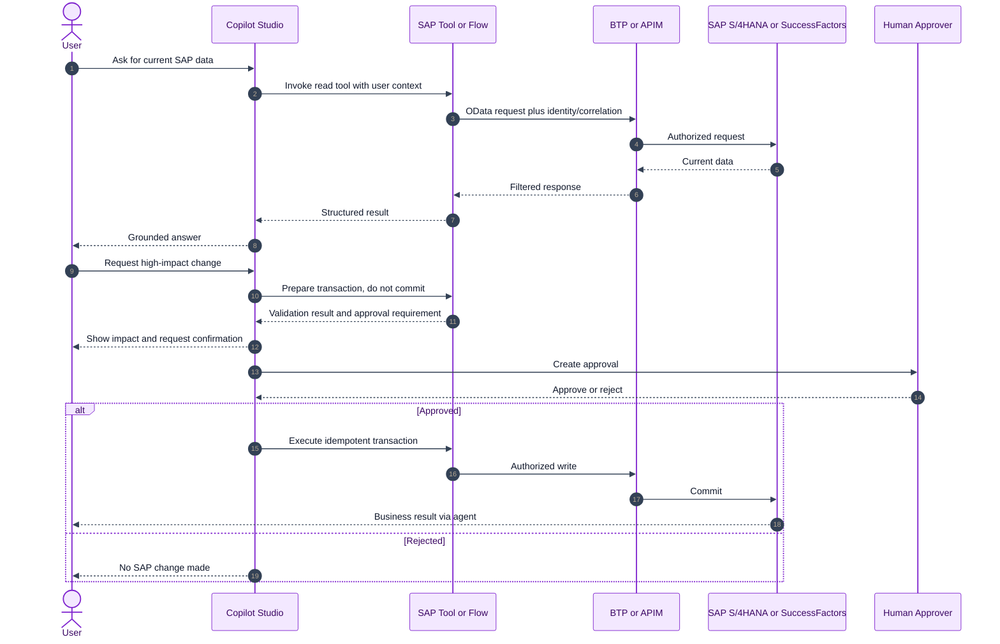
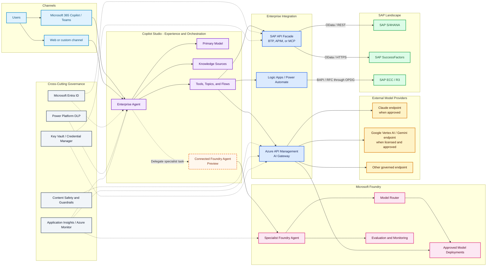
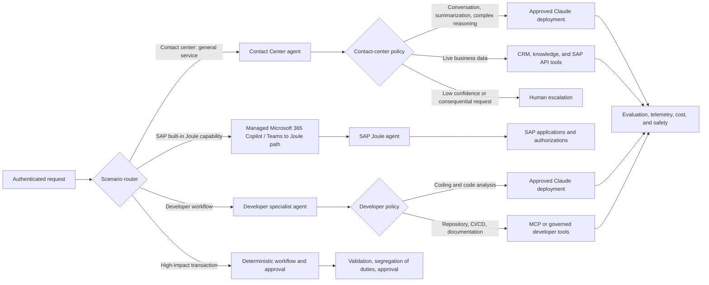
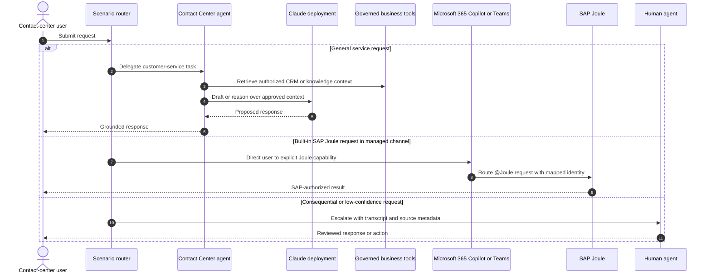
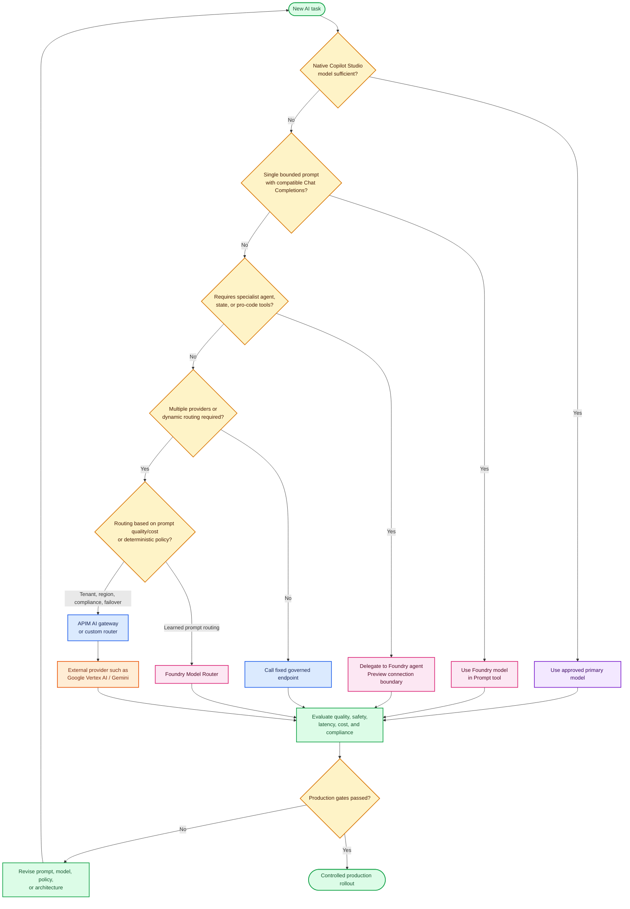
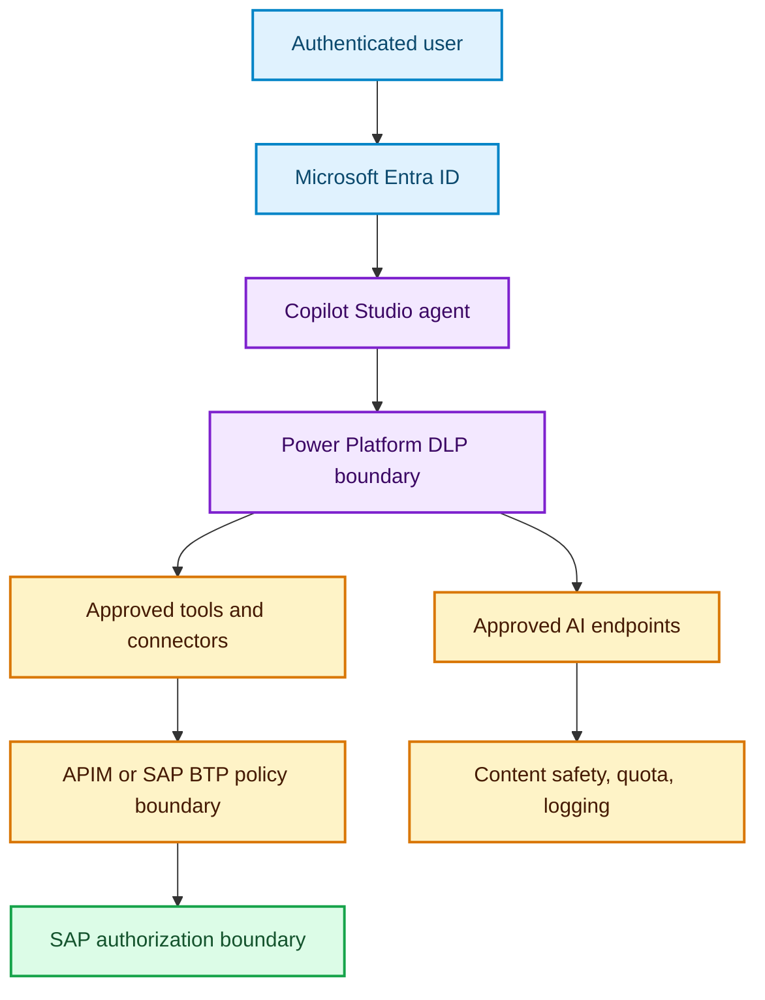

# Arsitektur L400: Copilot Studio, Microsoft Foundry, SAP, dan Multi-Model AI

> **Jenis dokumen:** Explanation dengan Reference appendix (Diátaxis)  
> **Audiens:** Enterprise solution architect  
> **Tujuan:** Menentukan kapan menggunakan Copilot Studio, Microsoft Foundry, SAP integration services, Model Router, dan AI gateway untuk solusi agent enterprise  
> **Status informasi:** Diverifikasi terhadap Microsoft Learn pada **26 Juli 2026**  
> **Bahasa:** Bahasa Indonesia dengan istilah teknis resmi berbahasa Inggris

## Catatan cakupan dan validasi

Dokumen ini tidak menganggap semua model AI dapat dipasang langsung ke Copilot Studio.

- Copilot Studio hanya menampilkan model yang didukung untuk region, environment, dan kebijakan administrator terkait ([Microsoft Learn: ketersediaan model dan kontrol admin](https://learn.microsoft.com/microsoft-copilot-studio/authoring-select-agent-model#model-availability-by-region)).
- Microsoft Foundry **tidak wajib** untuk semua implementasi Copilot Studio.
- Integrasi model Foundry pada sebuah Prompt tool tidak otomatis mengganti primary model atau orchestrator seluruh agent.
- Google Gemini belum didokumentasikan sebagai native primary model Copilot Studio pada tanggal verifikasi dokumen ini ([Microsoft Learn: ketersediaan primary model](https://learn.microsoft.com/microsoft-copilot-studio/authoring-select-agent-model#model-availability-by-region)).
- Connected Microsoft Foundry agent masih berstatus **Preview** ([Microsoft Learn](https://learn.microsoft.com/microsoft-copilot-studio/add-agent-foundry-agent)).
- Fitur, model, status rilis, region, harga, dan batas dapat berubah. Validasi ulang halaman Microsoft Learn sebelum production deployment.

## Legenda status

| Simbol | Arti | Penggunaan production | Sumber status |
|---|---|---|---|
| 🟢 GA | Generally available | Dapat dipertimbangkan untuk production setelah pengujian organisasi | [Microsoft Learn: model release types](https://learn.microsoft.com/microsoft-copilot-studio/authoring-select-agent-model#model-release-types) |
| 🟡 Preview | Pratinjau dan tunduk pada preview terms | Jangan diasumsikan memiliki SLA atau stabilitas GA | [Microsoft Learn: model release types](https://learn.microsoft.com/microsoft-copilot-studio/authoring-select-agent-model#model-release-types) |
| 🧪 Experimental | Untuk evaluasi awal | Tidak direkomendasikan untuk production | [Microsoft Learn: batas experimental](https://learn.microsoft.com/microsoft-copilot-studio/authoring-select-agent-model#limitations-of-experimental-and-preview-models) |
| 🌍 Cross-geo | Pemrosesan dapat terjadi di luar geography organisasi | Memerlukan persetujuan data residency dan administrator | [Microsoft Learn: ketersediaan model](https://learn.microsoft.com/microsoft-copilot-studio/authoring-select-agent-model#model-availability-by-region) |

---

## Daftar isi

1. [Ringkasan eksekutif](#1-ringkasan-eksekutif)
2. [Apakah semua model dapat digunakan dan apakah Foundry wajib](#2-apakah-semua-model-dapat-digunakan-dan-apakah-foundry-wajib)
3. [Cara Copilot Studio menggunakan LLM](#3-cara-copilot-studio-menggunakan-llm)
4. [Pola integrasi Copilot Studio dan Microsoft Foundry](#4-pola-integrasi-copilot-studio-dan-microsoft-foundry)
5. [Integrasi SAP S4HANA dan SAP SuccessFactors](#5-integrasi-sap-s4hana-dan-sap-successfactors)
6. [Arsitektur referensi yang direkomendasikan](#6-arsitektur-referensi-yang-direkomendasikan)
7. [Menentukan model untuk setiap skenario](#7-menentukan-model-untuk-setiap-skenario)
8. [Foundry Model Router dan Azure API Management AI gateway](#8-foundry-model-router-dan-azure-api-management-ai-gateway)
9. [Identity, security, dan Responsible AI](#9-identity-security-dan-responsible-ai)
10. [Reliability, observability, performance, dan cost](#10-reliability-observability-performance-dan-cost)
11. [Roadmap implementasi](#11-roadmap-implementasi)
12. [Batasan dan temuan penting](#12-batasan-dan-temuan-penting)
13. [Reference appendix](#13-reference-appendix)
14. [Referensi Microsoft Learn](#14-referensi-microsoft-learn)

---

## 1. Ringkasan eksekutif

Arsitektur yang direkomendasikan menggunakan pembagian tanggung jawab berikut:

| Komponen | Tanggung jawab utama | Kapan digunakan |
|---|---|---|
| **Copilot Studio** | User experience, generative orchestration, topics, knowledge, tools, actions, dan connected agents | Default untuk low-code enterprise agent yang digunakan melalui Microsoft 365, Teams, atau channel lain |
| **Microsoft Foundry** | Pro-code specialist agent, model deployment, evaluasi, model catalog, dan Model Router | Ketika diperlukan kontrol model, agent khusus, evaluasi mendalam, atau routing model dinamis |
| **Azure API Management AI gateway** | Policy enforcement, provider abstraction, authentication, token quota, content safety, metrics, load balancing, dan circuit breaker | Ketika beberapa model/provider dipakai bersama atau organisasi memerlukan control plane API terpusat |
| **SAP OData connector** | Akses CRUD terhadap SAP OData API | Pilihan utama untuk S/4HANA, SuccessFactors, dan produk SAP modern yang menyediakan OData |
| **SAP ERP connector + OPDG** | Akses BAPI/RFC | Sistem SAP lama atau fungsi yang belum tersedia melalui OData |
| **SAP BTP/API Management/Cloud Connector** | Integrasi dan konektivitas yang dikelola tim SAP | Ketika organisasi sudah menggunakan SAP BTP atau SAP backend berada di balik firewall |
| **Microsoft Entra ID** | Authentication, SSO, user context, dan principal propagation | Wajib sebagai fondasi identity enterprise bila pola integrasi mendukungnya |

Prinsip utamanya adalah **memisahkan user-facing orchestration, model inferencing, knowledge, dan business tools**. Copilot Studio tidak boleh menjadi jalur akses langsung tanpa kontrol menuju database SAP. Agent harus memanggil connector, API, flow, atau MCP tool yang menegakkan authorization sendiri.

### Gambar resmi: pilihan platform agent Microsoft


*Gambar 1. Pilihan pembangunan agent: Microsoft Foundry untuk kontrol pro-code, Copilot Studio untuk low-code, dan custom infrastructure untuk kontrol maksimum. Sumber: [Technology plan for AI agents - Microsoft Learn](https://learn.microsoft.com/azure/cloud-adoption-framework/ai-agents/technology-solutions-plan-strategy). Gambar ditemukan melalui pencarian WebIQ terhadap Microsoft Learn pada 26 Juli 2026.*

---

## 2. Apakah semua model dapat digunakan dan apakah Foundry wajib

### Jawaban singkat

**Tidak semua model dapat digunakan sebagai native primary model Copilot Studio. Microsoft Foundry juga tidak selalu diperlukan.**

| Kebutuhan | Foundry diperlukan? | Pola yang benar |
|---|---:|---|
| Menggunakan default atau primary model yang tersedia di Copilot Studio | Tidak | Pilih model pada halaman Overview agent |
| Menggunakan model eksternal yang disediakan native oleh Copilot Studio, misalnya provider yang tercantum pada model picker | Tidak | Administrator mengaktifkan external models dan provider terkait |
| Menggunakan model Foundry untuk satu Prompt tool | Ya | Deploy model yang kompatibel di Foundry lalu hubungkan endpoint Chat Completions |
| Menggunakan specialist Foundry agent | Ya | Tambahkan connected Microsoft Foundry agent; status integrasi ini masih [Preview](https://learn.microsoft.com/microsoft-copilot-studio/add-agent-foundry-agent) |
| Menggunakan Foundry Model Router | Ya | Deploy Model Router dan panggil melalui Foundry agent, custom action, atau integration service |
| Menggunakan Gemini yang tidak muncul di native model picker Copilot Studio | Tidak wajib | Gunakan custom action/connector menuju governed external endpoint; APIM direkomendasikan untuk enterprise |
| Menggunakan beberapa provider dengan quota, observability, dan policy yang seragam | Tidak wajib, tetapi sering berguna | Tempatkan APIM AI gateway di depan backend model |

### Empat level pemilihan model

1. **Agent-level primary model**  
   Model untuk generative orchestration utama agent. Pemilihan dilakukan pada model picker Copilot Studio.

2. **Capability-specific settings**  
   Deep reasoning, generative responses, dan Prompt builder memiliki pengaturan model terpisah. Mengubah satu pengaturan tidak boleh diasumsikan mengubah semuanya.

3. **Prompt-level model**  
   Sebuah Prompt tool dapat dikunci ke deployment Foundry tertentu. Hanya eksekusi prompt tersebut yang memakai model itu.

4. **External orchestration or routing**  
   Foundry Model Router, specialist agent, atau custom routing service dapat memilih backend secara dinamis di luar native primary-model mechanism Copilot Studio.

> **Kesimpulan arsitektur:** Gunakan native model picker untuk kebutuhan sederhana. Tambahkan Foundry hanya ketika kontrol dan kompleksitas tambahan memberikan manfaat nyata. Tambahkan APIM ketika ada kebutuhan governance lintas aplikasi atau lintas provider.

---

## 3. Cara Copilot Studio menggunakan LLM

Copilot Studio bukan hanya pembungkus satu endpoint LLM. Runtime agent menggabungkan beberapa capability:

- **Generative orchestration** untuk memilih topics, tools, knowledge, dan connected agents.
- **Primary model** untuk penalaran dan koordinasi utama agent.
- **Generative answers** untuk menyusun jawaban yang digrounding pada knowledge source.
- **Prompt tools** untuk operasi AI yang lebih terarah, misalnya klasifikasi, ekstraksi, atau transformasi.
- **Actions dan flows** untuk menjalankan operasi terhadap sistem eksternal.
- **Connected agents** untuk mendelegasikan tugas ke agent dengan batas domain berbeda.

### Apa yang dipilih oleh orchestrator

Generative orchestration memilih **capability** berdasarkan instruksi, deskripsi, context percakapan, dan metadata. Ini berbeda dari model routing.

| Mekanisme | Yang dipilih | Contoh |
|---|---|---|
| Copilot Studio generative orchestration | Topic, tool, knowledge source, atau connected agent | Memilih tool `GetPurchaseOrder` ketika user menanyakan status PO |
| Copilot Studio primary-model selection | Model utama untuk agent | Memilih model General untuk employee self-service |
| Prompt tool model selection | Model tetap untuk satu prompt | Memakai model khusus untuk ekstraksi invoice |
| Foundry Model Router | Underlying model per request berdasarkan prompt dan routing mode | Memilih model kecil untuk klasifikasi dan model reasoning untuk analisis |
| APIM/custom deterministic router | Backend berdasarkan policy eksplisit | Memilih provider berdasarkan data classification, tenant, region, atau failover state |

### Native primary models

Copilot Studio mendokumentasikan kategori model berikut:

- **General:** latency dan cost lebih rendah untuk chat sehari-hari, drafting, summarization, translation, FAQ, dan automasi sederhana.
- **Deep:** deliberate multistep reasoning, analytics, troubleshooting, policy analysis, dan tool-rich workflows.
- **Auto:** adaptive behavior untuk workload dengan tingkat kompleksitas yang beragam.

Model dan statusnya berubah cepat. Jangan hard-code asumsi ketersediaan berdasarkan nama model di dokumen desain. Gunakan halaman [Select a primary AI model for your agent](https://learn.microsoft.com/microsoft-copilot-studio/authoring-select-agent-model) sebagai source of truth pada saat deployment.

### External models yang native di Copilot Studio

Dokumentasi Microsoft mencantumkan provider eksternal seperti **Anthropic, Mistral, dan xAI**. Penggunaan memerlukan:

1. External models diizinkan pada Power Platform environment atau environment group.
2. Provider terkait diizinkan melalui Microsoft 365 admin center.
3. Review atas status GA/Preview/Experimental, data handling terms, dan kemungkinan cross-geo processing ([Microsoft Learn](https://learn.microsoft.com/microsoft-copilot-studio/authoring-select-agent-model#model-release-types)).

External model bukan sinonim dengan preview model. Administrator dapat mengizinkan salah satu kategori dan memblokir kategori lainnya ([Microsoft Learn: kontrol external model](https://learn.microsoft.com/microsoft-copilot-studio/authoring-select-external-response-model#admin-controls-and-requirements-for-external-models)).

### Model fallback

Dokumentasi primary-model selection menyatakan bahwa default model dapat menjadi fallback ketika model pilihan dimatikan atau tidak tersedia. Jangan menganggap behavior fallback yang sama berlaku untuk custom Prompt tool atau external API. Definisikan timeout, error handling, dan fallback secara eksplisit untuk integrasi tersebut.

---

## 4. Pola integrasi Copilot Studio dan Microsoft Foundry

### Pola A: Copilot Studio tanpa Foundry

Gunakan pola ini ketika:

- Model native memenuhi kebutuhan kualitas, latency, dan compliance.
- Integrasi utama menggunakan connectors, flows, atau knowledge sources.
- Tim membutuhkan lifecycle low-code dan governance Power Platform.

**Kelebihan:** arsitektur sederhana, lebih sedikit komponen, lebih mudah dioperasikan.  
**Keterbatasan:** kontrol deployment model, fine-tuning, dan pro-code agent lebih terbatas.

### Pola B: Foundry model untuk Prompt tool

Copilot Studio dapat menghubungkan deployment Foundry ke sebuah Prompt tool.

**Batas teknis yang diverifikasi:**

- Endpoint harus bertipe **Chat Completions** dan berakhir dengan `/chat/completions`.
- Responses API endpoint tidak dapat digunakan pada jalur ini.
- Dokumentasi saat ini menyatakan keluarga GPT-5 dan model yang lebih baru belum didukung untuk bring-your-own-model pada prompts.
- Tidak semua model di catalog otomatis kompatibel hanya karena model tersebut terlihat di catalog.
- Connector `Azure AI Foundry` dapat diatur melalui Power Platform data policy.

Gunakan pola ini untuk capability sempit dan dapat diuji, misalnya:

- Klasifikasi intent khusus.
- Ekstraksi field dari dokumen.
- Penyusunan ringkasan dengan format tertentu.
- Penggunaan domain model yang kompatibel.

Jangan menggunakan pola ini untuk mengklaim bahwa seluruh Copilot Studio agent telah berpindah ke model Foundry.

#### How-to: menambahkan model Microsoft Foundry ke Copilot Studio

Prosedur berikut mengikuti [Bring your own model for your prompts - Microsoft Learn](https://learn.microsoft.com/en-us/microsoft-copilot-studio/bring-your-own-model-prompts). Integrasi ini menambahkan model ke **Prompt tool**, bukan mengganti primary model seluruh agent.

> **Klarifikasi penting — bukan semua model Foundry:** Halaman Microsoft Learn menyebut akses ke lebih dari 1.800 model dalam Foundry catalog, tetapi bagian **Supported models and limitations** membatasi integrasi Copilot Studio ini pada deployment yang menyediakan endpoint **Chat Completions** yang kompatibel. Catalog membership bukan jaminan kompatibilitas. GPT-5 dan model yang lebih baru secara eksplisit belum didukung pada jalur BYOM prompts ini. Model embedding, reranking, image generation, audio, model yang hanya menyediakan Responses API, atau model dengan inference API khusus tidak dapat diasumsikan bekerja melalui connector ini. Gunakan plugin, custom action, flow, atau governed API gateway untuk capability yang tidak kompatibel.

##### Compatibility gate

Sebelum mencoba connection, model harus lolos seluruh pemeriksaan berikut:

| Pemeriksaan | Harus terpenuhi |
|---|---|
| Deployment tersedia | Model dapat dideploy dan deployment aktif pada subscription/region yang digunakan |
| Inference task | Model mendukung conversational **chat completion**, bukan hanya embedding, reranking, image generation, audio, atau task khusus lain |
| Endpoint | Endpoint deployment berakhir dengan `/chat/completions` |
| Product exclusion | Model bukan GPT-5 atau keluarga yang lebih baru pada jalur BYOM prompts saat ini |
| Modality | Text selalu divalidasi; image/document hanya digunakan bila model muncul sebagai kompatibel setelah input tersebut ditambahkan |
| Governance | Connector, DLP, provider terms, region, dan Responsible AI policy disetujui |
| Runtime validation | Connection berhasil dan prompt lulus functional, safety, latency, serta cost evaluation |

Jika salah satu pemeriksaan gagal, model tersebut **tidak terkonfirmasi dapat digunakan** melalui native Foundry Prompt connector, walaupun model terlihat pada Foundry catalog.

##### Contoh: apakah Qwen dapat digunakan?

**Secara teknis, Qwen adalah kandidat yang masuk akal, tetapi bukan jaminan universal.** Microsoft Learn mencantumkan beberapa Qwen melalui Fireworks on Foundry—misalnya `FW-Qwen3-14B`, `FW-Qwen3.5-9B`, dan keluarga Qwen3.6—dengan tipe **Chat completions**. Halaman tersebut juga menyatakan catalog models Fireworks mendukung OpenAI/v1 Chat Completions API. Karena itu, deployment Qwen tersebut memenuhi persyaratan API dasar untuk dicoba melalui Foundry Prompt connector.

Namun, penggunaan baru dapat dianggap terkonfirmasi setelah:

1. Fireworks on Foundry diaktifkan untuk subscription dan region yang didukung.
2. Qwen berhasil dideploy; tabel Microsoft Learn saat verifikasi ini mencantumkan Qwen catalog offers sebagai **PTU**, bukan pay-per-token.
3. Deployment menghasilkan Target URI yang berakhir dengan `/chat/completions` dan diterima oleh layar **Connect a model from Azure AI Foundry**.
4. Deployment name serta base model name dimasukkan persis dan connection test berhasil.
5. Prompt tool lulus runtime evaluation pada Copilot Studio.
6. Organisasi menerima data-processing terms Fireworks. Fireworks on Foundry berada di luar EU Data Boundary commitment, belum mencapai FedRAMP, dan tidak berlaku untuk PCI DSS menurut dokumentasi saat ini.

Microsoft Learn tidak secara eksplisit menyatakan “semua Qwen telah disertifikasi untuk Copilot Studio.” Oleh karena itu, kesimpulan yang didukung sumber adalah **Qwen Chat Completions deployment dapat dicoba dan kemungkinan kompatibel, tetapi compatibility harus dibuktikan per deployment**. Jika connector menolak endpoint, gunakan custom connector/action atau APIM AI gateway.

##### Prasyarat

Sebelum memulai, pastikan:

- Copilot Studio agent sudah tersedia pada environment yang benar.
- Model telah dideploy pada Microsoft Foundry dan menyediakan endpoint **Chat Completions**.
- Nama **Model deployment** dan **Base model** dicatat persis seperti yang ditampilkan di Foundry.
- Endpoint model berakhir dengan `/chat/completions`, misalnya `https://<resource>.services.ai.azure.com/openai/deployments/<deployment-name>/chat/completions`.
- Maker memiliki izin untuk membuat connection dan menggunakan deployment tersebut.
- Administrator telah meninjau Power Platform data policy untuk connector `Azure AI Foundry`, data residency, dan Responsible AI controls.

##### Langkah 1: buat atau buka agent

1. Masuk ke [Copilot Studio](https://copilotstudio.microsoft.com/).
2. Untuk agent baru, pilih **Agents** > **New agent** > **Skip to configure**.
3. Isi konfigurasi agent, lalu pilih **Create**. Untuk agent yang sudah ada, buka agent tersebut.

##### Langkah 2: tambahkan Prompt tool

Gunakan salah satu jalur berikut:

- **Sebagai tool:** buka tab **Tools**, pilih **Add a tool** > **New tool** > **Prompt**.
- **Di dalam topic:** buka tab **Topics**, tambahkan node dengan tanda plus (**+**), lalu pilih **Add a topic** > **New prompt**.

Berikan nama yang menjelaskan satu capability, misalnya `ExtractInvoiceFields`. Pada bagian **Instructions**, tulis instruksi, input, output, format, dan batasan yang dapat diuji. Hindari membuat satu prompt untuk banyak tanggung jawab yang tidak berhubungan.

##### Langkah 3: hubungkan deployment Foundry

1. Pada panel di sisi kanan **Instructions**, buka dropdown **Model**.
2. Pilih tanda plus (**+**) untuk menghubungkan model dari Microsoft Foundry.
3. Pada layar **Connect a model from Azure AI Foundry**, masukkan endpoint model dan informasi deployment.
4. Masukkan **Model deployment name** dan **Base model name** persis seperti yang tercantum di Foundry. Perbedaan kapitalisasi atau nama dapat menyebabkan connection gagal.
5. Pilih **Connect**.


*Screenshot A. Memilih model pada Custom Prompt. Sumber: [Bring your own model for your prompts - Microsoft Learn](https://learn.microsoft.com/en-us/microsoft-copilot-studio/bring-your-own-model-prompts).* 


*Screenshot B. Menghubungkan deployment model Foundry. Sumber: [Bring your own model for your prompts - Microsoft Learn](https://learn.microsoft.com/en-us/microsoft-copilot-studio/bring-your-own-model-prompts).*

##### Langkah 4: gunakan dan uji model

1. Pastikan model yang baru dihubungkan muncul pada dropdown **Model**.
2. Pilih model tersebut untuk Prompt tool.
3. Simpan prompt dan tambahkan ke agent atau topic yang sesuai.
4. Uji happy path, malformed input, empty input, prompt injection, timeout, rate limit, dan provider failure.
5. Bandingkan quality, groundedness, safety, latency, dan cost terhadap model baseline sebelum publish.

Setiap kali Prompt tool ini dijalankan, model yang dipilih untuk prompt tersebut digunakan. Tool dan prompt lain tetap menggunakan konfigurasi model masing-masing; primary model agent tidak berubah.

##### Troubleshooting dan batasan

| Gejala | Kemungkinan penyebab | Tindakan |
|---|---|---|
| `Resource not found` | Menggunakan Responses endpoint `/openai/v1/responses` | Ganti ke endpoint Chat Completions yang berakhir dengan `/chat/completions` |
| Model tidak dapat dipilih | Model atau endpoint tidak kompatibel, connection belum tersedia, atau DLP memblokir | Periksa tipe endpoint, connection, izin, dan Power Platform data policy |
| Connection gagal | Deployment name atau base model name tidak cocok | Salin kedua nama persis dari Foundry |
| GPT-5 atau yang lebih baru tidak bekerja | Jalur BYOM prompts saat ini tidak mendukung keluarga tersebut | Gunakan model yang kompatibel atau pola integrasi lain yang didukung |
| Model vision tidak muncul setelah menambah image input | Model tidak mendukung image input pada integrasi ini | Gunakan model vision yang tercantum sebagai kompatibel pada dokumentasi terkini |
| Membutuhkan image generation | Copilot Studio tidak mengekspos text-to-image model secara native pada catalog ini | Panggil model image generation melalui plugin atau custom action yang dikelola |

##### Governance setelah connection dibuat

- Connection model muncul pada halaman connections dan harus dimiliki oleh akun organisasi yang lifecycle-nya dikelola sesuai metode autentikasi connector yang didukung, bukan akun personal tanpa ownership plan.
- Terapkan DLP untuk connector `Azure AI Foundry` pada Power Platform admin center.
- Terapkan Responsible AI policy yang sesuai pada deployment Foundry.
- Catat prompt version, deployment name, base model, endpoint class, owner, region, dan evaluation evidence.
- Definisikan proses rotasi connection, model upgrade, retirement, dan rollback.

### Pola C: Connected Microsoft Foundry agent

Copilot Studio dapat menambahkan Foundry agent sebagai connected external agent. **Status fitur: 🟡 Preview** ([Microsoft Learn](https://learn.microsoft.com/microsoft-copilot-studio/add-agent-foundry-agent)).

Konfigurasi membutuhkan:

- Foundry project endpoint.
- Agent ID.
- Nama dan deskripsi yang jelas agar orchestrator mengetahui kapan harus mendelegasikan tugas.
- Foundry agent dari portal Foundry baru; dokumentasi menyatakan agent dari portal sebelumnya dapat menghasilkan error version not found.

Pola ini cocok ketika specialist agent memerlukan:

- Pro-code orchestration.
- Foundry tools dan model deployments.
- State atau retrieval yang dikelola di sisi specialist agent.
- Evaluasi dan observability tersendiri.

Untuk production, siapkan exit strategy karena integrasi masih [Preview](https://learn.microsoft.com/microsoft-copilot-studio/add-agent-foundry-agent): kontrak API terpisah, feature flag, fallback action, dan test suite regresi.

### Pola D: Custom action melalui AI gateway

Gunakan custom action, custom connector, atau Power Automate flow menuju API Management ketika:

- Provider tidak tersedia pada native model picker.
- Format API provider perlu dinormalisasi.
- Organisasi memerlukan token quota, centralized credentials, audit, content safety, atau chargeback.
- Beberapa aplikasi berbagi model deployments yang sama.

Foundry bersifat opsional pada pola ini. APIM dapat mengelola Foundry models maupun provider eksternal.

---

## 5. Integrasi SAP S4HANA dan SAP SuccessFactors

### Pisahkan knowledge dan action

| Jenis | Tujuan | Pola yang direkomendasikan |
|---|---|---|
| **Knowledge** | Menjawab pertanyaan berbasis dokumentasi atau data read-only | Knowledge source atau retrieval service dengan security trimming |
| **Live read** | Membaca saldo cuti, status order, vendor, atau purchase order terbaru | SAP OData connector atau governed API tool |
| **Transaction** | Membuat, mengubah, atau menyetujui record | Connector/API action dengan validation dan confirmation |
| **High-impact transaction** | Pembayaran, perubahan payroll, termination, atau posting finansial | Deterministic workflow, segregation of duties, human approval, dan audit log |

Jangan menggunakan RAG index sebagai pengganti live transactional API. Indexed data dapat stale dan tidak menjamin authorization terkini.

### Protocol decision

| SAP landscape | Protocol utama | Authentication umum | Catatan |
|---|---|---|---|
| SAP S/4HANA public cloud | OData | OAuth | Pilihan modern dan langsung untuk API yang tersedia |
| SAP S/4HANA private cloud/on-premises | OData atau BAPI/RFC | OAuth, SAP identity, Kerberos sesuai pola | Gunakan BTP, OPDG, atau APIM dengan private connectivity |
| SAP SuccessFactors | OData/HTTPS | OAuth | SAP OData connector mendukung SuccessFactors; Entra ID SSO path memiliki status yang harus diverifikasi |
| SAP ECC/R/3 | BAPI/RFC atau OData via SAP Gateway | SAP user/Kerberos | BAPI/RFC memerlukan OPDG dan SAP Connector for Microsoft .NET |
| Custom SAP service | REST/SOAP/OpenAPI/MCP | Sesuai service contract | Tempatkan facade untuk menyederhanakan schema dan authorization |

### Integration pattern selection

1. **Direct SAP OData connector**  
   Gunakan untuk cloud API yang sudah aman, sederhana, dan memenuhi governance.

2. **SAP BTP + SAP API Management + SAP Cloud Connector**  
   Gunakan bila tim SAP telah mengoperasikan BTP, API Management, dan connectivity ke backend.

3. **Azure API Management + virtual network peering**  
   Gunakan ketika SAP berada di Azure/RISE dan private network path tersedia.

4. **On-premises data gateway**  
   Gunakan untuk BAPI/RFC atau OData yang hanya dapat diakses dari jaringan internal.

5. **MCP facade**  
   Gunakan bila organisasi ingin mengekspos SAP capabilities sebagai discoverable tools. MCP tidak menghapus kewajiban authorization, schema validation, idempotency, dan approval.

### Gambar resmi: SAP BTP integration


*Gambar 2. SAP BTP, SAP API Management, dan SAP Cloud Connector sebagai integration layer menuju SAP backend. Sumber: [SAP Business Technology Platform with SAP API Management and SAP Cloud Connector - Microsoft Learn](https://learn.microsoft.com/azure/sap/microsoft-ai/copilot-studio/architecture-business-technology-platform-api). Gambar ditemukan melalui WebIQ pada 26 Juli 2026.*

### Identity propagation

Tujuan terbaik adalah mempertahankan identity user hingga SAP sehingga:

- SAP authorization tetap berlaku.
- Audit trail menunjukkan user sebenarnya.
- Agent tidak berubah menjadi shared super-user.
- Segregation of duties tetap dapat ditegakkan.

Gunakan service identity hanya untuk proses yang benar-benar non-user atau batch. Batasi izin, gunakan compensating controls, dan catat originating user serta correlation ID.

### Sequence: read dan write SAP



---

## 6. Arsitektur referensi yang direkomendasikan

### End-to-end architecture



*Sitasi lifecycle untuk diagram: label Connected Foundry Agent berstatus Preview menurut [Connect to a Microsoft Foundry agent](https://learn.microsoft.com/microsoft-copilot-studio/add-agent-foundry-agent). Eligibility model/provider harus diperiksa kembali pada dokumentasi service terkait saat deployment.*

### Keputusan desain utama

1. **Copilot Studio tetap menjadi experience orchestrator.**  
   Agent memutuskan capability yang dipanggil, bukan mengakses SAP atau provider model secara bebas.

2. **Foundry specialist agent dibatasi per domain.**  
   Contoh: contract analysis, engineering troubleshooting, atau complex financial reasoning.

3. **APIM menjadi policy boundary, bukan business orchestrator.**  
   Routing deterministik sederhana dapat dilakukan di APIM, tetapi workflow bisnis kompleks sebaiknya berada pada flow, service, atau agent yang dapat diuji.

4. **SAP API facade terpisah dari AI model gateway.**  
   Keduanya dapat memakai APIM, tetapi gunakan product, API, policy, credential, dan observability boundary yang terpisah. Untuk high-risk environment, pertimbangkan instance terpisah.

5. **Tidak ada direct database access dari agent.**  
   Semua data dan action melewati interface yang menegakkan authorization dan audit.

---

## 7. Menentukan model untuk setiap skenario

### Decision criteria

Nilai setiap skenario berdasarkan:

| Dimensi | Pertanyaan arsitektur |
|---|---|
| Task complexity | Apakah tugas sekadar ekstraksi/ringkasan atau membutuhkan multistep reasoning? |
| Business impact | Apakah output bersifat informasional, rekomendasi, atau dapat memicu transaksi? |
| Determinism | Apakah hasil dan latency harus konsisten pada setiap request? |
| Data classification | Apakah prompt berisi HR, payroll, finansial, PII, atau rahasia dagang? |
| Data residency | Apakah [cross-geo processing](https://learn.microsoft.com/microsoft-copilot-studio/authoring-select-agent-model#model-availability-by-region) diperbolehkan? |
| Tool support | Apakah model perlu function calling atau agentic tool use? |
| Modality | Apakah input berisi teks, image, audio, atau dokumen? |
| Context length | Apakah context melebihi kemampuan model terkecil dalam router subset? |
| Latency SLO | Apakah user-facing response memerlukan low time-to-first-token? |
| Cost ceiling | Berapa budget per conversation atau per business transaction? |
| Provider terms | Apakah procurement, legal, dan compliance telah menyetujui provider? |
| Evaluation evidence | Apakah model telah lulus benchmark menggunakan data representatif? |

### Scenario-to-model matrix

| Skenario | Routing owner | Rekomendasi | Alasan |
|---|---|---|---|
| FAQ HR berbasis kebijakan | Copilot Studio | Native General atau approved default model | Latency dan cost lebih penting daripada deep reasoning |
| Cek saldo cuti SuccessFactors | Copilot Studio + SAP tool | Native General; gunakan live OData tool | Model tidak menjadi source of truth; SAP API menjadi source of truth |
| Ringkasan purchase order | Prompt tool | Model kecil/General yang telah diuji | Task terarah dan mudah dievaluasi |
| Analisis kontrak kompleks | Copilot Studio atau Foundry specialist agent | Deep model atau Quality routing | Membutuhkan multistep reasoning dan citation discipline |
| Klasifikasi ribuan record secara batch | Foundry/API service | Cost mode atau fixed small model | Throughput dan cost lebih penting; pisahkan dari interactive traffic |
| Workload campuran dengan kompleksitas tidak stabil | Foundry Model Router | Balanced mode sebagai baseline | Router dapat memilih model berdasarkan karakteristik prompt |
| Payroll atau tindakan HR berisiko tinggi | Deterministic workflow | Model hanya menyiapkan proposal; approval wajib sebelum commit | Jangan menyerahkan keputusan final kepada probabilistic routing |
| Provider-specific Gemini capability | APIM/custom integration | Endpoint Google yang disetujui | Gemini tidak didokumentasikan sebagai native Copilot Studio primary model |
| Requirement bahwa model harus sama pada setiap request | Direct deployment | Pin fixed model dan version | Hindari nondeterminism dari model router |
| Strict data-residency workload | Governance policy | Model dan deployment yang memenuhi region requirement | Jangan memakai [cross-geo model](https://learn.microsoft.com/microsoft-copilot-studio/authoring-select-agent-model#model-availability-by-region) tanpa persetujuan |

### Menentukan skenario mana yang terhubung ke model atau agent tertentu

Gunakan **dua keputusan routing yang terpisah**. Jangan menggabungkannya menjadi satu prompt yang tidak transparan:

1. **Scenario atau agent routing:** Tentukan business domain, kemudian delegasikan ke agent, workflow, atau tool yang sesuai. Routing connected agent di Copilot Studio menggunakan nama dan deskripsi agent, pesan user, conversation context, serta instruksi primary agent ([Microsoft Learn](https://learn.microsoft.com/microsoft-copilot-studio/agents-experience/add-agent-connected#how-the-orchestrator-routes-to-connected-agents)).
2. **Model routing di dalam domain terpilih:** Pilih fixed model atau approved model pool berdasarkan task fit, complexity, latency, cost, context, region, dan compliance. Microsoft merekomendasikan evaluasi task fit per model, manual selection untuk critical path yang harus predictable, serta automatic routing untuk workload yang bervariasi ([Microsoft Learn](https://learn.microsoft.com/azure/architecture/ai-ml/guide/choose-ai-model#key-criteria-for-model-selection)).

Scenario router tidak boleh memperlakukan **Joule sebagai LLM model**. Joule adalah SAP digital assistant/agent. Claude adalah keluarga LLM. Topologinya adalah **routing agent/workflow terlebih dahulu**, kemudian **pemilihan model di dalam agent yang terpilih**.



*Dasar arsitektur: route ke connected agents melalui metadata yang distinct dan primary instructions ([Microsoft Learn](https://learn.microsoft.com/microsoft-copilot-studio/agents-experience/add-agent-connected#how-the-orchestrator-routes-to-connected-agents)); pilih model berdasarkan task fit, cost, latency, dan compliance ([Microsoft Learn](https://learn.microsoft.com/azure/architecture/ai-ml/guide/choose-ai-model#key-criteria-for-model-selection)); gunakan Joule melalui managed integration Microsoft 365 Copilot/Teams untuk built-in SAP scenarios yang didukung ([Microsoft Learn](https://learn.microsoft.com/azure/sap/microsoft-ai/joule/joule-copilot-overview)).*

#### Skenario 1: Contact Center menggabungkan Claude dan Joule

Pola yang direkomendasikan **bukan** mengirim satu prompt ke Claude dan Joule lalu menggabungkan dua jawaban free-form yang belum diverifikasi. Gunakan capability boundaries:

| Keputusan | Route | Aturan implementasi |
|---|---|---|
| Percakapan contact center umum, summarization, classification, atau response drafting | Contact Center agent dengan approved Claude model | Pilih Claude yang tersedia untuk environment dan region; validasi quality, latency, dan data handling terhadap [tabel model Copilot Studio terkini](https://learn.microsoft.com/microsoft-copilot-studio/authoring-select-agent-model#model-availability-by-region) |
| Pertanyaan SAP built-in yang didukung Joule, misalnya saldo cuti, procurement, atau status invoice | Managed Microsoft 365 Copilot/Teams → `@Joule` → SAP Joule | Managed integration meneruskan explicit SAP request ke Joule dan mempertahankan SAP identity mapping ([Microsoft Learn](https://learn.microsoft.com/azure/sap/microsoft-ai/joule/joule-copilot-overview#architecture-overview)) |
| Custom Contact Center agent membutuhkan SAP data atau action | Copilot Studio/Foundry agent → SAP OData, BTP, APIM, atau MCP tool | Jangan mengasumsikan managed Joule integration dapat dipanggil custom Copilot Studio agent; Microsoft mendokumentasikan bahwa custom agents dan skills tidak dirutekan melalui integrasi tersebut ([Microsoft Learn](https://learn.microsoft.com/azure/sap/microsoft-ai/joule/joule-copilot-overview#limitations-and-known-issues)) |
| Request mencakup customer conversation dan SAP data | Deterministic workflow mengoordinasikan percakapan berbasis Claude dengan governed SAP API tool; alternatifnya, user memanggil `@Joule` secara eksplisit pada managed channel | Pisahkan source, correlation ID, citation, dan authorization decision; jangan meminta satu model menyamar sebagai agent lainnya |
| Complaint, financial commitment, perubahan akun, atau hasil dengan confidence rendah | Human handoff atau approval workflow | Tidak ada autonomous model-to-model decision untuk consequential action |



**Batas platform penting:** integrasi bidirectional Joule adalah managed feature SAP dan Microsoft untuk Microsoft 365 Copilot dan Teams. Integrasi ini saat ini tidak diperluas ke custom-built Copilot Studio agents ([Microsoft Learn](https://learn.microsoft.com/azure/sap/microsoft-ai/joule/joule-copilot-overview#limitations-and-known-issues)). Untuk custom contact-center channel, gunakan governed SAP APIs/connectors alih-alih merancang panggilan Copilot Studio-to-Joule yang tidak terdokumentasi.

#### Skenario 2: Developer requests dirutekan ke Claude

Gunakan dedicated Developer agent dengan deskripsi yang distinct, misalnya: “Menangani penjelasan source code, code generation, debugging, test design, dan pull-request analysis. Tidak menangani SAP business transaction atau employee support.” Deskripsi yang distinct mengurangi routing ambiguity ([Microsoft Learn](https://learn.microsoft.com/microsoft-copilot-studio/agents-experience/manage-connected-agents#troubleshoot-routing-issues)).

Policy yang direkomendasikan:

| Developer task | Route | Pola model/tool |
|---|---|---|
| Code generation, debugging, refactoring, atau complex code review | Developer specialist agent → approved Claude model | Pin Claude jika consistency dan coding behavior yang sudah diketahui diperlukan; verifikasi lifecycle dan regional availability terkini pada [Microsoft Learn](https://learn.microsoft.com/microsoft-copilot-studio/authoring-select-agent-model#model-availability-by-region) |
| Repository lookup, build logs, CI/CD status, atau documentation | Developer agent → governed MCP/OpenAPI tools | Model menginterpretasikan hasil; tools tetap menjadi source of truth dan menggunakan least-privilege identity |
| Simple classification atau high-volume triage | Small fixed model atau Foundry Model Router mode Cost/Balanced | Gunakan automatic routing hanya bila variability dapat diterima; monitor underlying model yang terpilih ([Microsoft Learn](https://learn.microsoft.com/azure/foundry/openai/how-to/model-router-agents#get-started)) |
| Production deployment, secret access, merge, atau destructive action | Deterministic workflow dengan policy dan approval | Developer model mengusulkan; authorized workflow memvalidasi dan mengeksekusi |
| SAP development question | Developer agent → SAP documentation/API tool atau dedicated SAP developer agent | Jangan route ke Joule kecuali user memakai documented managed Joule experience dan built-in capability-nya mencakup task tersebut |

#### Template scenario routing policy

Definisikan setiap route sebagai versioned configuration, bukan hanya mengandalkan free-form model judgment:

| Policy field | Contoh Contact Center | Contoh Developer |
|---|---|---|
| Route ID | `contact-center-v1` | `developer-v1` |
| Entry criteria | Customer-service channel atau intent | Authenticated developer role, developer portal, atau coding intent |
| Primary agent | Contact Center agent | Developer specialist agent |
| Fixed model | Approved Claude model untuk response drafting/reasoning | Approved Claude model untuk code tasks |
| Specialist agent/tool | Joule hanya melalui supported managed channel; selain itu SAP/CRM APIs | Repository, CI/CD, documentation, dan test tools |
| Model Router use | Opsional untuk low-risk triage | Opsional untuk classification dan broad developer Q&A |
| Data boundary | Customer dan CRM policy | Source-code, secret, dan repository policy |
| Human gate | Complaint, commitment, perubahan akun | Merge, deploy, secrets, destructive operations |
| Fallback | Human agent atau safe response | Fixed baseline model atau human reviewer |
| Required telemetry | Scenario, agent, model, tools, citations, escalation reason | Scenario, agent, selected model, repository/tool calls, approval outcome |

Router sebaiknya mengevaluasi structured signals dalam urutan berikut: **channel dan authenticated role → explicit user selection/tag → data classification dan policy → business intent → agent metadata → model policy**. Dengan urutan ini, compliance dan high-impact boundaries tetap deterministic, sementara generative routing masih dapat digunakan di approved low-risk domains.

### Routing decision flow



*Sitasi lifecycle untuk decision flow: jalur connected agent dari Copilot Studio ke Foundry berstatus Preview menurut [Microsoft Learn](https://learn.microsoft.com/microsoft-copilot-studio/add-agent-foundry-agent).* 

### Model selection governance loop

1. Bentuk representative evaluation dataset dari use case nyata dan data yang sudah disanitasi.
2. Tentukan baseline model.
3. Ukur factuality, task completion, groundedness, safety, latency percentile, dan cost.
4. Uji tool calling dan authorization failure paths.
5. Catat model, version, deployment, prompt version, router mode, dan subset.
6. Lakukan staged rollout.
7. Monitor drift dan perubahan distribusi routing.
8. Re-evaluate sebelum model upgrade atau retirement.

---

## 8. Foundry Model Router dan Azure API Management AI gateway

### Foundry Model Router

Model Router adalah deployment Foundry yang menganalisis prompt dan memilih underlying model yang sesuai. Mode yang didokumentasikan:

| Mode | Tujuan | Skenario |
|---|---|---|
| **Balanced** | Menyeimbangkan quality dan cost | Starting point untuk workload campuran |
| **Quality** | Memprioritaskan kualitas tertinggi | Reasoning kritis yang masih dapat menerima variability |
| **Cost** | Memprioritaskan penghematan | High-volume atau batch workload |

Kemampuan penting versi aktif yang didokumentasikan:

- Model subset untuk membatasi model yang boleh dipilih.
- Azure Policy untuk governing deployment dan publisher.
- Automatic failover bila subset/default pool memiliki alternatif yang sesuai.
- Dukungan sejumlah OpenAI, DeepSeek, Meta, xAI, dan Anthropic models; beberapa non-OpenAI dan Claude routing tetap berstatus Preview ([Microsoft Learn: supported models dan footnotes](https://learn.microsoft.com/azure/foundry/openai/concepts/model-router#supported-models)).
- Claude harus dideploy secara terpisah sebelum dapat dipilih oleh router.
- Effective context limit dipengaruhi model terkecil dalam subset.

**Jangan menggunakan Model Router ketika:**

- Workflow memerlukan model dan version yang sama setiap saat.
- Tugas menggunakan fine-tuned model dengan SLO sempit.
- Output harus reproducible atau latency sangat deterministik.
- Compliance hanya menyetujui satu deployment.

### Azure API Management AI gateway

APIM AI gateway menyediakan cross-cutting controls untuk model, agents, tools, MCP servers, dan A2A APIs. Dokumentasi mencantumkan dukungan schema berikut:

- OpenAI Chat Completions atau Responses API.
- Anthropic Messages API pada APIM v2 tiers yang didukung.
- Google Vertex AI API.
- Passthrough dan OpenAI-compatible endpoints.

Unified model API berstatus **🟡 Preview** dan dapat memberikan satu OpenAI-compatible endpoint dengan translation lintas provider ([Microsoft Learn](https://learn.microsoft.com/azure/api-management/unified-model-api)).

### Gambar resmi: APIM AI gateway


*Gambar 3. AI gateway mengontrol model, agent, dan tools melalui security, traffic management, observability, dan governance. Sumber: [AI gateway in Azure API Management - Microsoft Learn](https://learn.microsoft.com/azure/api-management/genai-gateway-capabilities). Ditemukan melalui WebIQ/Microsoft Learn research pada 26 Juli 2026.*

### Pembagian peran Router dan Gateway

| Pertanyaan | Foundry Model Router | APIM AI gateway |
|---|---|---|
| Memilih model berdasarkan kompleksitas prompt | Ya | Bisa melalui policy/custom logic, tetapi bukan tujuan utama ML router |
| Menyeimbangkan quality dan cost secara learned | Ya | Tidak secara otomatis kecuali dibangun policy/service sendiri |
| Provider protocol normalization | Tidak | Ya, termasuk [unified model API Preview](https://learn.microsoft.com/azure/api-management/unified-model-api) |
| Token quota per consumer | Bukan control utama | Ya |
| Authentication dan credential isolation | Melalui Foundry/Azure controls | Ya, termasuk managed identity dan credential manager |
| Content safety policy di gateway | Tidak sebagai gateway policy | Ya |
| Load balancing antar deployment | Router memilih model pool | Backend pool menyediakan weighted/priority/session-aware balancing |
| Circuit breaker | Automatic failover dalam router scope | Ya untuk backend APIs |
| Chargeback dan token metrics | Azure monitoring/cost | Ya, custom dimensions dan metrics per consumer |
| External Gemini/Vertex endpoint | Tidak didokumentasikan sebagai supported router model | Ya, Google Vertex AI API didokumentasikan |

> **Best practice:** Model Router dan APIM dapat digunakan bersama. Model Router menentukan model berdasarkan prompt; APIM menegakkan policy, identity, quota, safety, dan observability. Jangan menambahkan keduanya bila native Copilot Studio sudah memenuhi kebutuhan.

---

## 9. Identity, security, dan Responsible AI

### Security boundaries



### Identity recommendations

- Gunakan Entra ID dan delegated identity bila downstream system perlu menghormati user authorization.
- Gunakan managed identity untuk APIM menuju Azure-hosted backends ketika didukung.
- Simpan non-Azure provider credentials di APIM credential manager atau Key Vault; jangan di topic, prompt, atau environment variable maker yang tidak terkontrol.
- Propagasikan correlation ID, user/tenant context, dan operation ID tanpa membocorkan token ke model.
- Terapkan least privilege pada connector, flow owner, service principal, dan SAP technical user.

### DLP dan data governance

- Tempatkan connector `Azure AI Foundry`, SAP connectors, HTTP/custom connectors, dan storage connectors pada Power Platform data groups yang benar.
- Blokir perpindahan data dari business connector ke unapproved external connector.
- Pisahkan dev, test, dan production environments.
- Terapkan solution-aware ALM; jangan melakukan konfigurasi production langsung oleh individual maker.
- Review [cross-geo](https://learn.microsoft.com/microsoft-copilot-studio/authoring-select-agent-model#model-availability-by-region) dan third-party terms sebelum mengaktifkan external models.

### Prompt injection dan unsafe tool use

1. Anggap semua text dari SAP, email, dokumen, dan website sebagai untrusted data.
2. Jangan izinkan retrieved content mengubah system instruction atau policy.
3. Validasi tool arguments terhadap schema dan business rules.
4. Gunakan allowlist operations, bukan generic execute endpoint.
5. Gunakan idempotency key untuk SAP write.
6. Minta confirmation dan approval untuk consequential actions.
7. Batasi jumlah record, nilai transaksi, dan scope query.
8. Log decision dan tool outcome, tetapi redaksi secret dan sensitive payload.

### Responsible AI gates

- Model/provider risk review.
- Harm and jailbreak testing.
- Groundedness dan factuality evaluation.
- Human oversight untuk keputusan berdampak tinggi.
- User disclosure bahwa output dihasilkan AI.
- Incident response dan kill switch.
- Periodic access review dan model retirement plan.

---

## 10. Reliability, observability, performance, dan cost

### Reliability

- Tetapkan timeout budget per hop: Copilot Studio, flow/action, gateway, model, dan SAP.
- Gunakan circuit breaker dan priority/weighted backend pools pada APIM bila ada beberapa endpoints.
- Gunakan setidaknya dua model pada custom Model Router subset bila automatic failover diperlukan.
- Definisikan fallback yang aman: fallback jawaban read-only boleh berbeda dari fallback transaksi.
- Jangan retry SAP write tanpa idempotency dan transaction-status check.
- Kembalikan structured error yang dapat dibedakan: unauthorized, validation, rate limit, provider unavailable, dan business rejection.

### Observability

Gunakan correlation ID yang sama sejauh platform memungkinkan:

```text
conversation-id
  -> copilot-session-id
    -> tool-invocation-id
      -> gateway-request-id
        -> foundry-trace-id / model-deployment
        -> sap-business-transaction-id
```

Minimal metrics:

| Area | Metrics |
|---|---|
| Experience | Task completion, containment, escalation, abandonment |
| Quality | Groundedness, factuality, tool-selection accuracy, approval rejection |
| Model | Input/output tokens, selected underlying model, latency p50/p90/p95, error rate |
| Gateway | Quota rejection, cache hit, circuit state, backend distribution |
| SAP | API latency, authorization failure, transaction success, duplicate prevention |
| Safety | Blocked prompt, blocked response, prompt-injection indicator, policy violation |
| Cost | Cost per conversation, task, department, model, dan provider |

Jangan mencatat raw payroll, HR, atau financial prompt tanpa privacy review. Gunakan sampling, redaction, dan retention policy.

### Performance

- Pisahkan interactive dan batch deployments.
- Gunakan model terkecil yang lulus quality threshold.
- Minimalkan tool descriptions dan context yang tidak relevan.
- Gunakan retrieval, bukan memasukkan seluruh dokumen ke context.
- Gunakan caching hanya untuk data yang aman dan tepat. Cache key harus mempertimbangkan tenant, identity/role, model, prompt version, dan policy context.
- Jangan cache data personal seperti saldo cuti sebagai jawaban global.

### Cost

- Tetapkan token quota per application, environment, department, atau tenant.
- Ukur cost per completed business task, bukan hanya cost per token.
- Gunakan Model Router Cost mode hanya setelah evaluasi kualitas.
- Terapkan semantic cache bila data aman, cukup repetitif, dan freshness dapat dikendalikan.
- Reserve deep models untuk task yang benar-benar memerlukan reasoning.

---

## 11. Roadmap implementasi

### Fase 0: Architecture dan governance

- Definisikan use cases, data classification, dan success metrics.
- Pilih region dan approved model/provider list.
- Bentuk Power Platform DLP policy.
- Tentukan SAP API ownership dan SAP API policy compliance.
- Rancang identity propagation dan audit.
- Bangun evaluation dataset dan threat model.

**Exit criteria:** architecture, provider, identity, DLP, dan risk approval tersedia.

### Fase 1: Read-only SAP pilot

- Bangun Copilot Studio agent dengan native GA model yang lifecycle dan ketersediaan regional terkininya diverifikasi di [Microsoft Learn](https://learn.microsoft.com/microsoft-copilot-studio/authoring-select-agent-model#model-availability-by-region).
- Hubungkan satu read-only SAP OData API.
- Batasi satu user group dan non-sensitive dataset.
- Tambahkan citations atau structured source information.
- Ukur quality, latency, dan authorization accuracy.

**Exit criteria:** tidak ada unauthorized retrieval dan quality threshold tercapai.

### Fase 2: Governed actions

- Tambahkan validation dan confirmation.
- Gunakan idempotency.
- Tambahkan approval untuk high-impact actions.
- Integrasikan audit dan business transaction ID.
- Uji retry, timeout, partial failure, dan duplicate request.

**Exit criteria:** transaction integrity dan segregation of duties terverifikasi.

### Fase 3: Foundry specialist capability

- Gunakan Prompt tool bila hanya satu capability yang membutuhkan model berbeda.
- Gunakan connected Foundry agent bila diperlukan state, pro-code tools, atau domain boundary.
- Tandai [Preview dependency](https://learn.microsoft.com/microsoft-copilot-studio/add-agent-foundry-agent) dan implementasikan fallback.
- Jalankan comparative evaluation terhadap native baseline.

**Exit criteria:** manfaat Foundry terukur dan lebih besar daripada tambahan kompleksitas.

### Fase 4: Multi-model routing dan AI gateway

- Tambahkan APIM untuk central governance bila ada beberapa consumers/providers.
- Mulai Model Router dengan Balanced mode dan approved subset.
- Deploy Claude secara terpisah sebelum memasukkannya ke router subset bila digunakan.
- Log selected underlying model.
- Benchmark quality, cost, dan latency dengan minimal dataset representatif.

**Exit criteria:** routing policy, fallback, observability, dan cost guardrails lulus production gate.

### Fase 5: Production hardening

- Load dan resilience testing.
- Red-team dan prompt-injection testing.
- Disaster recovery dan provider outage drill.
- Model upgrade/retirement runbook.
- Operational dashboard, alerts, dan on-call ownership.
- Quarterly access, provider, dan DLP review.

---

## 12. Batasan dan temuan penting

### Temuan yang harus ditulis apa adanya

1. **Tidak ada dukungan native untuk model apa pun.**  
   Native picker adalah curated dan dikendalikan oleh region serta administrator.

2. **Gemini bukan native primary model Copilot Studio pada sumber yang diverifikasi.**  
   Integrasi dapat dilakukan melalui external API/custom action. APIM mendokumentasikan Google Vertex AI API sebagai backend yang dapat dikelola.

3. **Foundry bukan prasyarat Copilot Studio.**  
   Foundry diperlukan hanya untuk capability Foundry tertentu: model deployment untuk Prompt tool, Model Router, atau Foundry agent.

4. **BYOM Prompt tidak sama dengan BYOM orchestrator.**  
   Model hanya digunakan saat Prompt tool tersebut dijalankan.

5. **BYOM Prompt memiliki compatibility limits.**  
   Chat Completions diperlukan; Responses endpoint tidak didukung pada jalur ini; GPT-5 dan yang lebih baru saat ini dinyatakan tidak didukung.

6. **Connected Foundry agent masih [Preview](https://learn.microsoft.com/microsoft-copilot-studio/add-agent-foundry-agent).**  
   Production architecture memerlukan fallback dan risk acceptance.

7. **Model Router bersifat non-deterministik.**  
   Gunakan direct deployment bila fixed model merupakan requirement.

8. **Claude di Model Router memiliki langkah dan status khusus.**  
   Claude deployment harus dibuat terpisah dan router support untuk Claude tercantum sebagai Preview pada tabel model saat verifikasi ([Microsoft Learn](https://learn.microsoft.com/azure/foundry/openai/concepts/model-router#supported-models)).

9. **Auto category Copilot Studio tidak boleh disamakan dengan custom multi-provider router.**  
   Dokumentasi menyatakan adaptive routing, tetapi tidak memberikan jaminan bahwa maker dapat menentukan provider atau policy per request.

10. **SAP Joule interoperability tidak otomatis mencakup custom Copilot Studio agent.**  
    Microsoft Learn menyatakan integrasi bidirectional Joule/Microsoft 365 Copilot tidak saat ini diperluas ke custom-built Copilot Studio agents.

### Assumptions yang harus divalidasi per organisasi

- SAP edition, network topology, dan API availability.
- Power Platform environment region.
- Data residency dan [cross-geo approval](https://learn.microsoft.com/microsoft-copilot-studio/authoring-select-agent-model#model-availability-by-region).
- Provider procurement dan legal terms.
- APIM tier yang mendukung capability yang dibutuhkan.
- Foundry model dan region availability.
- Authentication method yang dapat dilakukan SAP backend.
- Required recovery time, latency, dan throughput.

---

## 13. Reference appendix

### 13.1 Capability comparison

| Capability | Copilot Studio native | Foundry Prompt model | Connected Foundry agent | APIM/external API |
|---|---:|---:|---:|---:|
| Low-code authoring | Kuat | Digunakan melalui Copilot Studio Prompt | Connection low-code, agent pro-code/Foundry | Custom integration |
| Agent-wide primary model | Ya | Tidak | Foundry agent memiliki model sendiri | Tidak otomatis |
| Per-prompt fixed model | Prompt builder settings | Ya | Bisa di dalam agent | Ya |
| Learned dynamic model routing | Auto behavior dikelola platform | Tidak | Ya bila agent memakai Model Router | Tidak tanpa custom router |
| Deterministic provider routing | Terbatas | Fixed deployment | Dapat dikodekan | Ya melalui policy/service |
| SAP connectors | Ya | Melalui Copilot tool | Melalui tool/API | Melalui custom connector/API |
| Model catalog flexibility | Curated | Compatible Foundry deployments | Tinggi | Provider-dependent |
| Central token quota lintas aplikasi | Platform-specific | Foundry-specific | Foundry-specific | Kuat melalui APIM |
| Provider protocol translation | Tidak | Tidak | Custom code | [Unified model API Preview](https://learn.microsoft.com/azure/api-management/unified-model-api) |
| Lifecycle risk | Model availability changes | Compatibility limits | [Preview connection](https://learn.microsoft.com/microsoft-copilot-studio/add-agent-foundry-agent) | Gateway/tier/provider complexity |

### 13.2 SAP pattern selection

| Kondisi | Pilihan pertama | Alternatif |
|---|---|---|
| S/4HANA public API tersedia | SAP OData connector | HTTP/custom connector melalui BTP/APIM |
| SuccessFactors user-context access | OData + approved OAuth/SSO pattern | SAP BTP API facade |
| BAPI/RFC wajib | SAP ERP connector + OPDG + SAP .NET Connector | Logic Apps SAP connector sesuai requirement |
| SAP di Azure/RISE dan private peering tersedia | APIM + VNet peering | SAP BTP + Cloud Connector |
| Tim SAP sudah menggunakan BTP | SAP API Management + Cloud Connector | Azure integration layer hanya bila ada gap |
| Tool discovery lintas agent diperlukan | Governed MCP facade | OpenAPI tools |

### 13.3 Model routing policy template

| Policy field | Contoh nilai |
|---|---|
| Business capability | Employee self-service |
| Data classification | Confidential HR |
| Allowed providers | Microsoft-hosted [GA models](https://learn.microsoft.com/microsoft-copilot-studio/authoring-select-agent-model#model-release-types) only |
| Allowed regions | EU Data Zone |
| Disallowed lifecycle | [Preview, Experimental](https://learn.microsoft.com/microsoft-copilot-studio/authoring-select-agent-model#model-release-types) |
| Default route | Approved General model |
| Escalation route | Approved Deep model after validation |
| Fixed-model exceptions | Payroll calculation explanation |
| Human approval | Required for HR record changes |
| Token quota | Per user and department |
| Logging | Metadata and redacted content only |
| Evaluation threshold | Organization-defined factuality, safety, latency, and cost targets |
| Fallback | Safe refusal or read-only response; no automatic transactional fallback |

### 13.4 Production readiness checklist

- [ ] Use case, scope, dan prohibited actions terdokumentasi.
- [ ] Model/provider lifecycle dan region diverifikasi ulang.
- [ ] Data residency dan legal approval selesai.
- [ ] Power Platform DLP policy diuji.
- [ ] Identity propagation dan SAP authorization diuji dengan beberapa role.
- [ ] Tidak ada direct database access dari agent.
- [ ] High-impact transaction memiliki confirmation dan approval.
- [ ] Idempotency dan duplicate protection tersedia.
- [ ] Prompt injection dan tool misuse diuji.
- [ ] Evaluation dataset mewakili production traffic.
- [ ] Latency p50/p90/p95 dan cost per task diukur.
- [ ] Model/router selection dicatat dalam telemetry.
- [ ] Secrets tidak berada di prompt atau topic.
- [ ] Timeout, retry, circuit breaker, dan fallback diuji.
- [ ] [Preview dependencies](https://learn.microsoft.com/microsoft-copilot-studio/authoring-select-agent-model#model-release-types) memiliki fallback dan risk acceptance.
- [ ] Model retirement dan provider outage runbook tersedia.

### 13.5 Glossary

| Istilah | Definisi |
|---|---|
| **Primary model** | Model yang digunakan untuk generative orchestration utama Copilot Studio agent |
| **Prompt tool** | Capability terarah yang menjalankan prompt dengan model yang dipilih untuk task tersebut |
| **BYOM** | Bring your own model; maknanya bergantung fitur dan tidak selalu berarti mengganti seluruh orchestrator |
| **Foundry Model Router** | Deployment ML yang memilih supported underlying model berdasarkan prompt dan routing mode |
| **AI gateway** | Policy boundary untuk model, agents, dan tools; dapat menyediakan security, quota, routing, dan observability |
| **OData** | Standard API protocol yang digunakan luas pada SAP S/4HANA, SuccessFactors, dan produk SAP lain |
| **BAPI/RFC** | Interface SAP tradisional yang dapat diakses melalui SAP ERP connector dan OPDG |
| **Principal propagation** | Meneruskan identity user agar authorization dan audit downstream tetap menggunakan user context |
| **MCP** | Model Context Protocol untuk mengekspos tools dan data capabilities melalui interface standar |
| **Grounding** | Memberikan context dari sumber tepercaya agar jawaban tidak hanya bergantung pada pengetahuan model |

---

## 14. Referensi Microsoft Learn

Semua referensi berikut diakses atau diverifikasi pada **26 Juli 2026**.

### Copilot Studio dan model

1. [Select a primary AI model for your agent](https://learn.microsoft.com/microsoft-copilot-studio/authoring-select-agent-model)
2. [Choose an external model as the primary AI model](https://learn.microsoft.com/microsoft-copilot-studio/authoring-select-external-response-model)
3. [Bring your own model for your prompts](https://learn.microsoft.com/microsoft-copilot-studio/bring-your-own-model-prompts)
4. [Connect to a Microsoft Foundry agent - Preview](https://learn.microsoft.com/microsoft-copilot-studio/add-agent-foundry-agent)
5. [Explore AI capabilities in Copilot Studio](https://learn.microsoft.com/microsoft-copilot-studio/guidance/ai-capabilities)
6. [Generative orchestration guidance](https://learn.microsoft.com/microsoft-copilot-studio/guidance/generative-orchestration)
7. [Application Card: Microsoft Copilot Studio](https://learn.microsoft.com/microsoft-copilot-studio/system-service-card-copilot-studio)
8. [Security and governance in Copilot Studio](https://learn.microsoft.com/microsoft-copilot-studio/security-and-governance)
9. [Data loss prevention for Copilot Studio](https://learn.microsoft.com/microsoft-copilot-studio/admin-data-loss-prevention)

### Microsoft Foundry dan model routing

10. [Microsoft Foundry Models overview](https://learn.microsoft.com/azure/foundry/concepts/foundry-models-overview)
11. [Model Router for Microsoft Foundry](https://learn.microsoft.com/azure/foundry/openai/concepts/model-router)
12. [How Model Router works](https://learn.microsoft.com/azure/foundry/openai/concepts/model-router-how-it-works)
13. [Use Model Router](https://learn.microsoft.com/azure/foundry/openai/how-to/model-router)
14. [Foundry Models from partners and community](https://learn.microsoft.com/azure/foundry/foundry-models/concepts/models-from-partners)
15. [Claude models in Microsoft Foundry](https://learn.microsoft.com/azure/foundry/foundry-models/concepts/claude-models)
16. [Fireworks models on Microsoft Foundry, including Qwen](https://learn.microsoft.com/azure/foundry/how-to/fireworks/enable-fireworks-models)

### SAP integration

17. [Copilot Studio with SAP](https://learn.microsoft.com/azure/sap/microsoft-ai/copilot-studio/copilot-with-sap-overview)
18. [SAP BTP with SAP API Management and SAP Cloud Connector](https://learn.microsoft.com/azure/sap/microsoft-ai/copilot-studio/architecture-business-technology-platform-api)
19. [On-premises data gateway for BAPI, RFC, and OData](https://learn.microsoft.com/azure/sap/microsoft-ai/copilot-studio/architecture-on-premises-data-gateway)
20. [Get started with the SAP OData connector](https://learn.microsoft.com/power-platform/sap/connect/sap-odata-connector)
21. [Set up Entra ID, APIM, and SAP for OData SSO](https://learn.microsoft.com/power-platform/sap/connect/entra-id-apim-oauth)
22. [Power Platform and SAP integration](https://learn.microsoft.com/power-platform/sap/explore/power-platform-and-sap-integration)

### AI gateway dan Well-Architected guidance

23. [AI gateway in Azure API Management](https://learn.microsoft.com/azure/api-management/genai-gateway-capabilities)
24. [Unified model API - Preview](https://learn.microsoft.com/azure/api-management/unified-model-api)
25. [Use a gateway in front of multiple model deployments](https://learn.microsoft.com/azure/architecture/ai-ml/guide/azure-openai-gateway-multi-backend)
26. [Access Foundry Models and other language models through a gateway](https://learn.microsoft.com/azure/architecture/ai-ml/guide/azure-openai-gateway-guide)
27. [Application design for AI workloads on Azure](https://learn.microsoft.com/azure/well-architected/ai/application-design)
28. [Technology plan for AI agents](https://learn.microsoft.com/azure/cloud-adoption-framework/ai-agents/technology-solutions-plan-strategy)
29. [Process to build agents across your organization](https://learn.microsoft.com/azure/cloud-adoption-framework/ai-agents/build-secure-process)
30. [Cara Copilot Studio melakukan routing ke connected agents - Preview](https://learn.microsoft.com/microsoft-copilot-studio/agents-experience/add-agent-connected#how-the-orchestrator-routes-to-connected-agents)
31. [Choose the right AI model for your workload](https://learn.microsoft.com/azure/architecture/ai-ml/guide/choose-ai-model)
32. [Joule and Microsoft 365 Copilot integration](https://learn.microsoft.com/azure/sap/microsoft-ai/joule/joule-copilot-overview)
33. [Connect an agent over the Agent2Agent protocol](https://learn.microsoft.com/microsoft-copilot-studio/add-agent-agent-to-agent)

---

## Catatan pemeliharaan

Dokumen ini harus ditinjau ulang ketika salah satu kondisi berikut terjadi:

- Copilot Studio menambah atau menghentikan model/provider.
- Connected Foundry agent berubah dari [Preview](https://learn.microsoft.com/microsoft-copilot-studio/add-agent-foundry-agent) menjadi GA atau contract-nya berubah.
- Foundry Model Router mengubah version, supported models, region, atau routing behavior.
- APIM unified model API berubah status atau schema.
- SAP API, authentication, atau network topology berubah.
- Kebijakan data residency, DLP, Responsible AI, atau procurement berubah.

**Recommended review cadence:** setiap kuartal dan sebelum setiap production model upgrade.